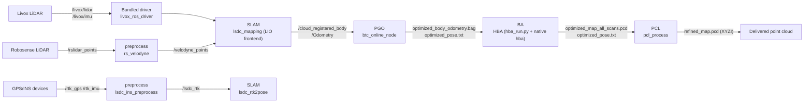

# System Overview: Module Interfaces and Full-Pipeline Data Flow

| Item | Value |
|---|---|
| Module | Appendix (cross-module) |
| Applicable version | all 5 modules (versions in the index section 2) |
| Last updated | 2026-09-10 |

## 1. Full-pipeline data flow

Position of the three preprocess blocks on the path:

| Block | Position |
|---|---|
| `lsdc_ins_preprocess` | independent branch: syncs GPS/IMU and outputs `/lsdc_rtk` for the SLAM RTK initialization chain |
| `rs_velodyne` | velodyne-scenario branch: converts Robosense clouds to `/velodyne_points` before `lsdc_mapping` |
| `Preprocess` / `PclPreprocess` | internal stage of the LIO frontend, compiled into the `lsdc_mapping` process |

## 2. Module interfaces (topics)

| Upstream module | Interface | Downstream module | Contract source |
|---|---|---|---|
| Bundled driver | `/livox/lidar` (CustomMsg/PointCloud2), `/livox/imu` | SLAM | `{prefix}common/lid_topic`, `common/imu_topic` of `lsdc_slam` |
| preprocess | `/lsdc_rtk` | SLAM (`lsdc_rtk2pose`) | `ins_preprocess.cpp` |
| preprocess | `/velodyne_points` | SLAM (`lsdc_mapping`) | `rs_to_velodyne.cpp` |
| SLAM | `/cloud_registered_body` (frame `body`), `/Odometry` (`T_camera_init_body`) | PGO | `Spikive-PGO/docs/frame_contract.md` |
| SLAM | `/drone_{id}_visual_slam/odom`, `/drone_{id}_cloud_registered`, `/mavros/*` | Flight controller / ground station | `lsdc_fusion_repub` |

## 3. Module interfaces (files)

| Upstream | File | Downstream | Constraints |
|---|---|---|---|
| PGO | `optimized_body_odometry.bag` | BA | topic `/cloud_registered_body` (frame `body`); validated by BA's `hba_inputs.py` |
| PGO | `optimized_pose.txt` | BA | TUM format `timestamp tx ty tz qx qy qz qw`, `T_world_body`, default world frame `camera_init` |
| BA | `optimized_map_all_scans.pcd` | PCL | HBA full-scan-order XYZI (FLOAT32), never reordered/resampled by third-party software |
| BA | `optimized_pose.txt` | PCL | same TUM format, nanosecond timestamps 1:1 with the cloud |
| BA | original body bag | PCL | the original bag used to produce the HBA results (`/cloud_registered_body`) |
| PCL | `refined_map.pcd` | delivery | FLOAT32 `x y z intensity` |

## 4. Image and environment summary

| Image | Build entry | Purpose | GTSAM |
|---|---|---|---|
| `spikive-slam:btc-noetic` | `Spikive-PGO/scripts/dev.sh build-image` | build and run of SLAM, preprocess, bundled driver, PGO | 4.2.0 (`/opt/spikive`) |
| `spikive-ba-env:gtsam411` | `Spikive-BA/scripts/hba.sh build-env` | BA dependency image; also the base of the PCL main image | 4.1.1 (`/opt/hba-gtsam411`) |
| `spikive-ba:v1.0.0-w20-g10` | `Spikive-BA/scripts/hba.sh build-image` | BA runtime | 4.1.1 |
| `spikive-pcl-process:1.0.0` | `Spikive-Pcl-Process/scripts/process.sh build` | PCL runtime | none (no GTSAM dependency) |

There is no shared GTSAM cache across images; PGO and BA use different GTSAM versions isolated in their own images and build prefixes (original text of `Spikive-BA/README.md`).

## 5. End-to-end run order

Run in this order; commands and interpretation for each step are in the corresponding module docs:

| Step | Operation | Docs |
|---|---|---|
| 1 | build the three images (the PGO image covers the SLAM/preprocess/driver build environment) | `pgoba/docker-build.md`, `pcl/docker-build.md` |
| 2 | start the Livox driver | `driver-livox/commandline.md` |
| 3 | start the LIO frontend (incl. preprocess) | `slam/commandline.md` |
| 4 | replay or run PGO online, export after EOF | `pgoba/commandline.md` Part 1 |
| 5 | run HBA global BA | `pgoba/commandline.md` Part 2 |
| 6 | run point-cloud refinement | `pcl/commandline.md` |

Steps 2-3 are the online chain; steps 4-6 are the offline chain joined by the file interfaces in section 3.

## 6. Data directory conventions

| Directory | Notes |
|---|---|
| `Spikive-PGO/results/` | PGO output (`SPIKIVE_RESULTS_DIR` redirectable; `/results` in the container) |
| `Spikive-PGO/.dev/` | PGO build state and experiment data (git-ignored) |
| `Spikive-BA/.dev/hba/` | BA working cache (`HBA_STATE_DIR` redirectable; intermediate per-frame PCDs under `work/`) |
| PCL `NEW_OUTPUT_DIR` | PCL output directory; must not exist; create a new one per run |
| `SPIKIVE_STATE_DIR` of `Spikive-PGO/scripts/dev.sh` | default `.dev/standalone` (build/devel/workspace) |

## 7. Content absent from the delivery package

| Content | Notes |
|---|---|
| build snapshots and experiment data (the `.dev/` of the inventory stage, ~9.9 GB) | removed from the package before delivery |
| `experiments/native_comparison/` | empty directory skeleton (0 files) |
| SLAM frontend sources other than FastLIO | the PGO container contains no frontend source (`Spikive-PGO/README.md` original text); the frontend is `Spikive-SLAM` |
| external package `lsdc_forward` | referenced by 3 SLAM launch files, outside the delivery scope (see pending items) |
