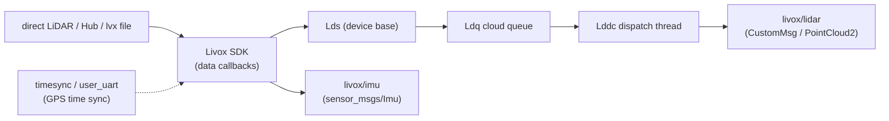

# Bundled Driver Module — Source Architecture

| Item | Value |
|---|---|
| Module | Bundled driver (livox_ros_driver) |
| Applicable version | `livox_ros_driver` git `master` @ `3d240d5` (2.6.0) |
| Last updated | 2026-09-10 |

## 1. Overall structure

A single ROS node `livox_lidar_publisher` (executable `livox_ros_driver_node`). Data flow: data source (direct LiDAR / Hub / lvx file) → Livox SDK callbacks → cloud queue → dispatch thread → ROS topics.

| Layer | Files |
|---|---|
| main entry | `livox_ros_driver/livox_ros_driver/livox_ros_driver.cpp` |
| device abstraction | `lds.{cpp,h}` (`Lds` base class, unified device callback entry) |
| data sources | `lds_lidar.{cpp,h}` (direct), `lds_hub.{cpp,h}` (Hub), `lds_lvx.{cpp,h}` (lvx file) |
| cloud queue | `ldq.{cpp,h}` |
| cloud dispatch | `lddc.{cpp,h}` (publisher and topic-name management) |
| lvx file parsing | `lvx_file.{cpp,h}` |
| communication protocols | `common/comm/` (`comm_protocol`, `sdk_protocol`, `gps_protocol`, `comm_device.h`) |
| time sync | `timesync/timesync.{cpp,h}`, `timesync/user_uart/` (GPS timestamp sync via serial `comm_device_type`) |
| third party | `common/FastCRC/`, `common/rapidjson/`, `common/rapidxml/` |

## 2. Core classes / functions

| Class / function | Location | Responsibility |
|---|---|---|
| `main` | `livox_ros_driver.cpp:54` | parses command-line broadcast codes, reads parameters, checks the SDK version (`kSdkVersionMajorLimit=2`), selects the data source by `data_src`, starts receive/send |
| `Lds` | `lds.{cpp,h}` | device base class: keeps SDK initialization results, sets `LidarDataCallback`/`ImuDataCallback` etc. |
| `LdsLidar` / `LdsHub` / `LdsLvx` | `lds_lidar.{cpp,h}` etc. | initialization and data intake of the three source types |
| `Lddc` | `lddc.{cpp,h}` | cloud dispatch: `GetCurrentPublisher`/`GetCurrentImuPublisher` return topic names per `multi_topic`; assembles and publishes `CustomMsg`/`PointCloud2` |
| `Ldq` | `ldq.{cpp,h}` | point-cloud queue buffering |
| `lvx_file` | `lvx_file.{cpp,h}` | lvx frame-header parsing and data reading |

## 3. Data flow

## 4. Topics and message formats

| Item | Notes |
|---|---|
| cloud topic | `multi_topic=0`: `livox/lidar`; `multi_topic=1`: `livox/lidar_<broadcast_code>` |
| cloud format | `xfer_format=0`: `PointCloud2` (custom `PointXYZRTL` layout); `=1`: `livox_ros_driver/CustomMsg`; `=2`: `PointCloud2` of pcl `PointXYZI` |
| IMU topic | `livox/imu` (`livox/imu_<bc>` when `multi_topic=1`), always `sensor_msgs/Imu` |
| frame_id | cloud defaults to `livox_frame` (launch `msg_frame_id`); IMU hardcoded `livox_frame` (`lddc.cpp:487`) |
| `CustomMsg` | `header`, `timebase`(uint64), `point_num`(uint32), `lidar_id`(uint8), `rsvd`(uint8[3]), `points[]` |
| `CustomPoint` | `offset_time`(uint32), `x/y/z`(float32), `reflectivity`(uint8), `tag`(uint8), `line`(uint8) |

## 5. Module interfaces and dependencies

| Direction | Target | Interface |
|---|---|---|
| Downstream | SLAM module (`lsdc_slam`) | cloud topic (subscribed via `{prefix}common/lid_topic`, `CustomMsg`), IMU topic (`common/imu_topic`) |
| Build downstream | `lsdc_slam` | depends on this package's message header `<livox_ros_driver/CustomMsg.h>` (`Spikive-SLAM/src/preprocess/ins_preprocess.cpp:6`, `src/LIO/preprocess.h:3`) |
| Runtime dependency | Livox SDK ≥ 2 | startup check at `livox_ros_driver.cpp:40,62` |
| Libraries | Boost, PCL, apr-1 | `CMakeLists.txt` |

## 6. Key configuration

| Config | Location | Key fields |
|---|---|---|
| `livox_lidar_config.json` | `config/` | `lidar_config[]` (`broadcast_code`, `enable_connect`, `return_mode`, `coordinate`, `imu_rate`, `extrinsic_parameter_source`, `enable_high_sensitivity`); `timesync_config` (`enable_timesync`, `device_name`, `comm_device_type`, `baudrate_index`, `parity_index`) |
| `livox_hub_config.json` | `config/` | `hub_config` (`broadcast_code`, `enable_connect`, `coordinate`); `lidar_config[]` (4 LiDARs) |
| launch parameters | 9 launch files | `xfer_format`, `multi_topic`, `data_src`, `publish_freq`, `bd_list`, `msg_frame_id` etc. (see `commandline.md`) |

Device-side parameters (`return_mode`, `imu_rate`, time sync) are pushed by the SDK at connection time per the JSON config; this package does not alter SDK data content.

## 7. Maintenance notes

- This package is an unmodified upstream clone (evidence in this module's `README.md` section 1); driver behavior changes should be done as patches or upstream version upgrades, not by editing the vendor tree in place.
- Upstream repository: `https://github.com/Livox-SDK/livox_ros_driver.git`, pinned commit `3d240d5` (`sources.repos`).
- A message-format change also affects the `preprocess` parsing of `lsdc_slam` (`avia_handler` in `src/LIO/preprocess.cpp`); verify jointly before changing.
