# Spikive SLAM Pipeline Delivery Documentation (Index)

| Item | Value |
|---|---|
| Module | Index (covers SLAM, PGOBA, PCL, preprocess, and the bundled driver) |
| Applicable version | Source package `src.zip` delivery snapshot (extracted root: `src/src/`), cloned 2026-09-06, delivered 2026-09-10 |
| Last updated | 2026-09-10 |

## 1. Purpose and scope

This documentation set targets the customer's engineers. It supports:

1. Running each module from the command line;
2. Building each module in a Docker environment;
3. Understanding the source architecture for maintenance.

Coverage is fixed to 5 modules: SLAM, PGOBA, PCL, preprocess, and the bundled driver. Each module document contains three sections: command-line usage, Docker build instructions, and source-level architecture.

This documentation set is the site content source: Chinese lives in `docs/zh/`, English in `docs/en/`. Maintenance conventions are in the repository root `README.md`.

## 2. Project composition and versions

| Module | Source directory | Package / project | Version | Version pin |
|---|---|---|---|---|
| SLAM | `Spikive-SLAM/` | ROS package `lsdc_slam` | `package.xml` declares `0.0.0` | git `main` @ `c86c818` (cloned from `QGDuan/Spikive-SLAM`) |
| PGOBA (PGO) | `Spikive-PGO/` | ROS package `spikive_btc` | `0.1.0` | git `dev` @ `3560a85`; `sources.repos` pins branch `dev` |
| PGOBA (BA) | `Spikive-BA/` | ROS package `spikive_ba` | `1.0.0` | git `main` @ `35324cb`; `sources.repos` pins the same commit (tag v1.0.0) |
| PCL | `Spikive-Pcl-Process/` | CMake project `spikive_pcl_process` | `1.0.0` (`VERSION` file) | git `main` @ `249b488`; not listed in `sources.repos` |
| preprocess | `Spikive-SLAM/src/preprocess/`, `Spikive-SLAM/src/LIO/preprocess.*` | Subsystem inside `lsdc_slam` | Follows the SLAM repo | Follows the SLAM repo |
| Bundled driver | `livox_ros_driver/` | ROS package `livox_ros_driver` | `2.6.0` | git `master` @ `3d240d5`; `sources.repos` pins the same commit |

Notes:

- Source paths are relative to the source root `src/src` (the directory containing the repositories above); documentation paths are relative to this repository root.
- preprocess has no standalone repository; its source lives inside `Spikive-SLAM`. This set documents it as an independent module with paths pointing to the actual location.
- The source root also contains `experiments/` (empty directory skeleton) and `reports/` (a research report). A `.dev/` directory (build snapshots and replay data) existed during inventory and was removed from the package before delivery; the package contains no build snapshots or experiment data.

## 3. End-to-end data flow

```mermaid
flowchart LR
    A["Livox LiDAR"] -->|"/livox/lidar<br>/livox/imu"| B["livox_ros_driver<br>node livox_lidar_publisher"]
    B --> C["Spikive-SLAM · lsdc_mapping<br>(LIO frontend, incl. scan preprocessing)"]
    C -->|"/cloud_registered<br>/Odometry"| D["lsdc_flight_controller<br>(flight-controller extrinsic)"]
    D -->|"/cloud_registered_trans<br>/Odometry_trans"| E["lsdc_fusion_repub<br>(stable topic forwarding)"]
    E -->|"/drone_N_visual_slam/odom<br>/drone_N_cloud_registered"| F["Spikive-PGO · btc_online_node<br>(BTC loops + GICP + PCM/GNC + iSAM2)"]
    F -->|"optimized_body_odometry.bag<br>optimized_pose.txt"| G["Spikive-BA · HBA<br>(hierarchical global BA)"]
    G -->|"optimized_map_all_scans.pcd<br>optimized_pose.txt"| H["Spikive-Pcl-Process · pcl_process<br>(SOR/MLS/TSDF surface refinement)"]
    H -->|"refined_map.pcd (XYZI)"| I["Delivered point cloud"]
```

Position of the preprocess nodes on the path:

- `lsdc_ins_preprocess`: subscribes to `ins/gps_topic` and `ins/imu_topic`, time-synchronizes them and publishes `/lsdc_rtk` for the RTK initialization chain (`lsdc_rtk2pose`);
- `rs_velodyne`: converts Robosense point clouds to `/velodyne_points` for the velodyne configuration of `lsdc_mapping`;
- `Preprocess`/`PclPreprocess` (compiled into `lsdc_mapping`): parses Livox/Ouster/Velodyne/S10U scans, converts timestamps, filters blind zones, thins points, extracts features and fuses multiple LiDARs; an internal stage of the LIO frontend.

## 4. Module navigation

| Module | Module index | Command line | Docker build | Architecture |
|---|---|---|---|---|
| SLAM | [slam](/en/slam/) | [slam/commandline](/en/slam/commandline) | [slam/docker-build](/en/slam/docker-build) | [slam/architecture](/en/slam/architecture) |
| PGOBA | [pgoba](/en/pgoba/) | [pgoba/commandline](/en/pgoba/commandline) | [pgoba/docker-build](/en/pgoba/docker-build) | [pgoba/architecture](/en/pgoba/architecture) |
| PCL | [pcl](/en/pcl/) | [pcl/commandline](/en/pcl/commandline) | [pcl/docker-build](/en/pcl/docker-build) | [pcl/architecture](/en/pcl/architecture) |
| preprocess | [preprocess](/en/preprocess/) | [preprocess/commandline](/en/preprocess/commandline) | [preprocess/docker-build](/en/preprocess/docker-build) | [preprocess/architecture](/en/preprocess/architecture) |
| Bundled driver | [driver-livox](/en/driver-livox/) | [driver-livox/commandline](/en/driver-livox/commandline) | [driver-livox/docker-build](/en/driver-livox/docker-build) | [driver-livox/architecture](/en/driver-livox/architecture) |

Appendix: [System overview](/en/appendix/system-overview), [Pending items](/en/appendix/pending-items), [Prompt version](/en/appendix/prompt-version)

## 5. Runtime environment baseline

| Item | Value |
|---|---|
| Host | Linux x86_64; `Spikive-PGO/README.md` records Ubuntu 22.04 host + ROS Noetic container as the verified environment |
| Container ROS | Noetic (all images are built from `ros-noetic-ros-base` and related packages) |
| Eigen | 3.3.7 (EXACT-checked in each image) |
| Ceres | 2.1.0 (built from source, installed to `/opt/spikive`) |
| GTSAM | PGO uses 4.2.0 (`/opt/spikive`); BA uses 4.1.1 (`/opt/hba-gtsam411`) |
| PCL | 1.10.0 in the BA/PCL images; `lsdc_slam`'s `CMakeLists.txt` requires PCL 1.8 or newer |
| Livox SDK | v2.3.0 (built from source inside the PGO image) |
| Driver | `livox_ros_driver` 2.6.0 (unmodified upstream clone; runtime requires Livox SDK major version ≥ 2) |

Build commands and version-lock file locations for each image are in the `docker-build` page of each module.

## 6. Documentation conventions

1. Every document file has a header with: module name, applicable version, and last-updated date.
2. Prose is written in the locale language; identifiers (commands, package names, file names, topic names, parameter names) keep their source form.
3. Commands are in language-tagged code blocks; commands executed inside the container and on the host are written separately. Host-side entry points are the `scripts/*.sh` files of each repository.
4. Source paths and paths inside commands use inline code formatting.
5. Commands, paths, or parameters that cannot be traced in the source are marked `[待确认]` / `[TBC]` and collected in [Pending items](/en/appendix/pending-items). The documentation does not state interfaces, parameters, class names, commands, or paths that do not exist in the source.
6. The documentation uses no adjectives and no subjective evaluation.
7. Chinese content (`docs/zh/`) is the base layer; English (`docs/en/`) mirrors it. The two stay file-for-file aligned; the site is built and published by GitHub Actions.

## 7. Entry points by task

| Task | Entry |
|---|---|
| Start the Livox driver (direct / Hub / lvx replay) | [driver-livox/commandline](/en/driver-livox/commandline) |
| Run the LIO frontend (Livox / S10U / Velodyne) | [slam/commandline](/en/slam/commandline) |
| Run the INS preprocess and Robosense conversion nodes | [preprocess/commandline](/en/preprocess/commandline) |
| Replay a dataset through BTC + PGO, or offline rebuild | [pgoba/commandline](/en/pgoba/commandline) |
| Run HBA global BA | [pgoba/commandline](/en/pgoba/commandline) (BA part) |
| Run point-cloud surface refinement | [pcl/commandline](/en/pcl/commandline) |
| Run the full pipeline in order | [appendix/system-overview](/en/appendix/system-overview) |

## 8. Pending items and prompt version

- Pending items: [appendix/pending-items](/en/appendix/pending-items)
- Prompt version: [appendix/prompt-version](/en/appendix/prompt-version)
