# PCL Module — Source Architecture

| Item | Value |
|---|---|
| Module | PCL |
| Applicable version | `Spikive-Pcl-Process` git `main` @ `249b488` (v1.0.0) |
| Last updated | 2026-09-10 |

## 1. Overall structure

Two layers:

1. Python orchestration layer (`scripts/process.py`, the image ENTRYPOINT): input validation, frame-index generation, C++ engine invocation, result validation, report and record generation;
2. C++ engine layer (`pcl_process`): loading, SOR/MLS smoothing, TSDF fusion, vertex export, intensity transfer, statistics output.

C++ target structure (`CMakeLists.txt:32-49`):

| Target | Composition |
|---|---|
| `voxblox_core` (STATIC) | 6 upstream voxblox source files + protoc-generated `Block.pb.cc`/`Layer.pb.cc` (unmodified TSDF + marching cubes, no ROS/ICP) |
| `process_core` | `src/pipeline.cpp`, `src/surface_export.cpp`, `src/intensity.cpp` (`PCL_NO_PRECOMPILE`, `-Wall -Wextra`) |
| `pcl_process` | `src/main.cpp`, linked to `process_core` |

## 2. Directory and file responsibilities

| File | Responsibility |
|---|---|
| `src/main.cpp` | entry: `readConfig` → load map PCD → `readFrames` → `smooth` → `fuse` → `attachIntensity` → write `refined_map.pcd.partial` → per-point PCL read-back check → write `native.json`; verifies XYZ unchanged by intensity transfer point-by-point (lines 37-39) |
| `src/pipeline.cpp` | `readConfig` (yaml parsing with range checks), `readFrames` (frame index with magic `SPFRM001` validation), `smooth` (SOR + tiled MLS), `fuse` (TSDF integration + marching cubes + parallel export + per-frame audit CSV) |
| `src/surface_export.cpp` | `exportSurfacePoints` (hash-sharded parallel dedup, bit-identical to native order), `availableCpuCount`, `resolveThreads` (0 → `ceil(2/3 × cores)`) |
| `src/intensity.cpp` | `attachIntensity` (`KdTreeFLANN` K=1, epsilon=0 XYZ nearest neighbor; copies the original intensity of the nearest valid MLS observation) |
| `include/process/pipeline.hpp` | types and declarations (`Point = pcl::PointXYZI`, `Config`, `Frame`, `Smoothed`, `FusionStats`, `IntensityStats`) |
| `include/process/surface_export.hpp` | vertex export and thread-resolution declarations |
| `scripts/process.py` | three-stage flow + all `require` checks + generation of `REPORT.md`/`records/` |
| `scripts/hba_io.py` | `read_poses` (TUM 8-column, nanosecond timestamps, unit quaternions), `read_pcd` (strict binary FLOAT32 PCD contract), `cloud_xyzi` (PointCloud2 decoding), `prepare` (frame timestamp alignment + RT numeric checks + `frames.bin`) |
| `scripts/verify_vendor.py` | upstream file SHA256 verification |

## 3. Core functions and data structures

### 3.1 Config and frame index

- `Config`: `threads`, `clean_*`, `mls_*`, `voxel_size`, `truncation`, `sensor_origin_body`;
- `Frame`: `stamp_ns` (nanosecond timestamp), `offset` (point offset), `count`, `translation`, `rotation`;
- `readFrames`: binary frame index with magic `SPFRM001`; validates frame offsets, coverage, monotonic timestamps and unit quaternions;
- `readConfig` checks: `schema=1`, `fusion.method=tsdf`, `sensor_origin_body_m` is a 3-element list, and parameter ranges.

### 3.2 `smooth` (`src/pipeline.cpp`)

1. optional `pcl::StatisticalOutlierRemoval` (`mean_k=20`, `stddev_mul=2.0`);
2. tiled by `tile_edge_m` with a full-radius halo, runs `pcl::MovingLeastSquares` (polynomial order 2, radius 0.08 m, no upsampling, `setCacheMLSResults(true)`, OpenMP);
3. keeps point provenance via `getCorrespondingIndices()`; records displacement RMS/max and `mls_no_output` (sparse points with no native PCL output);
4. returns `Smoothed`: cloud + `valid` mask + statistics.

### 3.3 `fuse` (`src/pipeline.cpp`)

1. builds `voxblox::Layer<voxblox::TsdfVoxel>` (voxel 0.02 m, block 16);
2. `SimpleTsdfIntegrator`: `use_const_weight=true`, `voxel_carving_enabled=false`, `allow_clear=false`, `min_ray_length=0`, `max_ray_length=max`;
3. per frame: origin `o_world = R×o_body + t`, identity rotation, `p_centred = p_world − o_world`; each MLS point is submitted exactly once;
4. `voxblox::MeshIntegrator<TsdfVoxel>::generateMesh(false,false)` (marching cubes zero-level surface);
5. releases TSDF blocks, then `exportSurfacePoints` parallel export; per-frame audit written to CSV.

### 3.4 `exportSurfacePoints` (`src/surface_export.cpp`)

- `nativeKey`: builds the `LongIndex` at the native default FLOAT32 `1e-10` merge scale (with `std::round` for negative coordinates);
- flow: collect all vertices → hash-shard by key (threads×threads buckets) → per-shard hash-table dedup keeping the first vertex in original traversal order → parallel sort to restore order → output `pcl::PointXYZ`;
- normals and triangle indices are not built (unused by the final XYZI); XYZ is bit- and order-identical to the unmodified upstream `getConnectedMesh()` (verified by `test_export.cpp`).

### 3.5 `attachIntensity` (`src/intensity.cpp`)

- `pcl::KdTreeFLANN<Point>` (valid MLS observations only, epsilon=0) performs K=1 exact XYZ nearest-neighbor per surface point;
- copies that observation's intensity verbatim; intensity is not a distance dimension; no truncation, normalization, averaging or distance gating;
- OpenMP parallel; records index/query timings, association-distance RMS/max and intensity min/max; any failed query throws.

### 3.6 Python orchestration (`scripts/process.py`)

```text
[1/3] prepare: validate HBA map/poses/body bag, generate frames.bin
[2/3] run the pcl_process engine (PROCESS_ENGINE), check native.json statistics against the inputs
[3/3] validate refined_map.pcd.partial (count, 4 fields, finiteness, unchanged input hashes)
      → generate records/ and REPORT.md → atomic rename publishes refined_map.pcd
on failure: write records/failure.json, do not publish the final cloud
```

## 4. Data and coordinate contract

From the README (the "exact data and coordinate contract" section):

1. the input map must be the HBA-exported raw full-scan-order XYZI;
2. HBA poses are TUM format `T_world_body`, already restored to world coordinates; do not multiply the first-frame origin matrix again;
3. `p_world = R_world_body * p_body + t_world_body`; the 20-micron HBA map verification tolerance serves FLOAT32 numerical and file-pairing acceptance, not cloud-quality filtering;
4. the LiDAR origin is a separate input: `o_world = R_world_body * o_body + t_world_body`; the body XYZ is never multiplied by the LiDAR extrinsic again;
5. MLS points use world-axis-aligned local coordinates centered on that frame's LiDAR origin: `p_local = p_world_MLS − o_world`; the transform passed to Voxblox is only `[I, o_world]`;
6. a scan-level fixed origin is an approximation; per-point motion compensation requires real acquisition records.

Boundaries (README): MLS results share neighborhoods and are correlated; TSDF here is geometric fusion of surface estimates and its weights are not calibrated independent measurement covariances; the output XYZ is a newly estimated surface, not a lossless point-count-preserving operation; intensity transfer is attribute transfer, not a new measurement or radiometric calibration.

## 5. Processing pipeline

```mermaid
flowchart LR
    A["optimized_map_all_scans.pcd<br>+ optimized_pose.txt<br>+ body bag"] --> B["hba_io.prepare<br>(timestamp alignment + RT checks)"]
    B --> C["frames.bin (SPFRM001)"]
    C --> D["smooth<br>(optional SOR → tiled MLS)"]
    D --> E["fuse<br>(SimpleTsdfIntegrator per frame)"]
    E --> F["marching cubes<br>zero-level surface"]
    F --> G["exportSurfacePoints<br>parallel vertex dedup export"]
    G --> H["attachIntensity<br>K=1 nearest-neighbor transfer"]
    H --> I["refined_map.pcd (XYZI)"]
```



## 6. Module interfaces and dependencies

| Direction | Target | Interface |
|---|---|---|
| Upstream | PGOBA (`Spikive-BA`) | `optimized_map_all_scans.pcd`, `optimized_pose.txt` (directory input) |
| Upstream | LIO data records | original body bag (`/cloud_registered_body`) |
| Output | delivered point cloud | `refined_map.pcd` (FLOAT32 XYZI) |
| Libraries | PCL 1.10.0 / Eigen 3.3.7 / Protobuf 3.6.1 / glog 0.4.0 / yaml-cpp / OpenMP | CMake EXACT checks |

The C++ core does not depend on ROS/GTSAM; ROS1 bags are decoded at file level by the Python `rosbags` library (README).

## 7. Key configuration

All `config/indoor.yaml` parameters and their meanings are in `commandline.md` section 3; fixed-baseline notes (README):

- `threads: 0` auto-selects 2/3 of logical CPUs; an explicit count is supported for comparison tests;
- bag reading, validation and disk writes still have serial/I/O stages; the thread count is not a per-moment CPU utilization guarantee;
- no GPU backend: the locked Voxblox upstream is CPU-only (the README states that Open3D/nvblox or a custom CUDA fuser are not used).

## 8. Tests and acceptance

6 CTest groups (`CMakeLists.txt:50-63`):

| Test | Content |
|---|---|
| `geometry_and_provenance` | tiled-MLS vs whole-map native MLS geometry agreement (2e-5 m), halo semantics, provenance retention, TSDF plane RMS < 0.015 m, single/multi-thread fusion agreement |
| `parallel_export_equivalence` | 1/4/auto-thread exports bit- and order-identical to upstream `getConnectedMesh()` |
| `intensity_provenance` | agreement with an independent exhaustive nearest-neighbor search; XYZ bit patterns unchanged; negative and >255 intensities not truncated |
| `input_contract` | nanosecond timestamps, non-unit quaternion rejection, exact PCD payload, big-endian PointCloud2 |
| `upstream_unchanged` | vendor file SHA256 verification |
| `hba_bag_end_to_end` | synthetic HBA + ROS1 bag end-to-end: missing origin produces no output, duplicate output directory rejected, failure writes `failure.json` |

Acceptance records are in `VALIDATION.md` (saier2biao XYZI run03: input 13,321 frames / 78,926,245 points, output 61,944,694 points, output SHA256 `094eea67…`).
