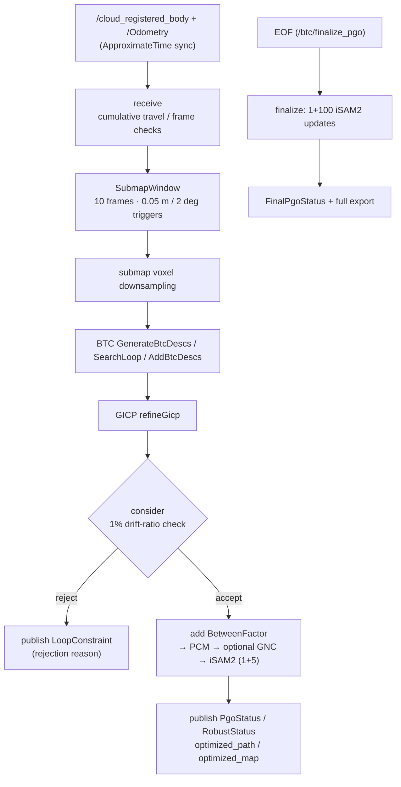
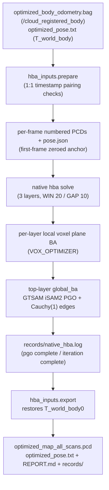

# PGOBA Module — Source Architecture

| Item | Value |
|---|---|
| Module | PGOBA |
| Applicable version | `Spikive-PGO` git `dev` @ `3560a85`; `Spikive-BA` git `main` @ `35324cb` |
| Last updated | 2026-09-10 |

This page has two parts: Part 1 covers the PGO backend (`Spikive-PGO`), Part 2 covers the BA backend (`Spikive-BA`).

# Part 1: PGO (`spikive_btc`)

## 1. Overall structure

One ROS node `btc_online_node` (node name configurable via `node_name` of `online.launch`) plus two offline replay tools. Build targets and sources (`CMakeLists.txt`):

| Target | Sources | Notes |
|---|---|---|
| `spikive_btc_upstream` (static) | `third_party/btc_descriptor/src/btc.cpp` | upstream BTC, SHA256-verified at configure time against `third_party/btc_descriptor.sha256` |
| `spikive_gicp` | `src/gicp_refine.cpp` + small_gicp's `registration_helper.cpp` | GICP refinement |
| `spikive_pcm_native` (static) | Kimera-RPGO's `Logger/GraphUtils/findClique/findCliqueHeu/graphIO/utils` | PCM max-clique solving |
| `spikive_pgo` | `src/pgo_backend.cpp` + `src/robust_optimizer.cpp` | pose-graph backend, linked to GTSAM, Ceres, Eigen |
| `btc_online_node` | `src/btc_online_node.cpp` | online node |
| `replay_pgo`, `replay_gicp_refinement` | `src/replay_pgo.cpp`, `src/replay_gicp_refinement.cpp` | frozen-graph / candidate replay |

## 2. Directory and file responsibilities

| File / directory | Responsibility |
|---|---|
| `src/btc_online_node.cpp` | class `OnlineBtc` and main: parameter validation, subscribers/publishers/services, main processing logic |
| `src/pgo_backend.{cpp,hpp}` | `PoseGraph` plus option/report structs (`BackendOptions`, `LoopReport`, `LoopState`, `FinalReport`) |
| `src/robust_optimizer.{cpp,hpp}` | `optimizeRobust`: PCM → optional GNC → iSAM2 |
| `src/gnc_isam2.hpp` | `GncIsam2Optimizer`: ISAM2 adapter for weighted subproblems |
| `src/gicp_refine.{cpp,hpp}` | `refineGicp`: small_gicp refinement on registration copies |
| `src/submap_window.hpp` | `SubmapWindow`: sliding submap window |
| `src/replay_pgo.cpp` | reads a SPIKIVE_PGO_V1 graph file and replays loops under `pcm_isam2` / `pcm_gnc_isam2` configurations |
| `src/replay_gicp_refinement.cpp` | frozen candidate-refinement replay; verifies ID consistency and writes a new graph file |
| `config/`, `launch/`, `msg/` | configuration, orchestration, messages (sections 7, 8 and `commandline.md`) |
| `scripts/` | orchestration and audit (see `commandline.md` section 5) |
| `third_party/btc_descriptor` | complete upstream BTC package (commit `742af157`); only `src/btc.cpp` is compiled |
| `third_party/Kimera-RPGO` | PCM implementation source (`outlier/Pcm.h`, `max_clique_finder/`), trimmed into `spikive_pcm_native` |
| `third_party/small_gicp` | small_gicp v1.0.1, GICP registration implementation |
| `docs/` | input contract, algorithm notes, validation records |

## 3. Core classes / functions / data structures

### 3.1 `OnlineBtc` (`src/btc_online_node.cpp`)

| Member | Responsibility |
|---|---|
| `receive` | ApproximateTime sync callback: frame validation, cumulative travel, submap window accumulation and triggering |
| `downsample` | one voxel downsample over the whole submap (optional point cap) |
| `recognize` | generates BTC descriptors, `SearchLoop` retrieval, `AddBtcDescs` insertion, graph vertex creation, publishes `PlaceRecognition`, runs GICP and `graph_->consider` |
| `publishConstraint` | publishes `LoopConstraint` and `RefinementDiagnostics` |
| `publishPgo` / `publishMap` / `publishMarkers` / `publishFinal` | publishes the optimized path, `PgoStatus`, `RobustStatus`, rebuilt submap points as `optimized_map`, loop edges, `FinalPgoStatus` |
| `finalize` | service `/btc/finalize_pgo` (Trigger): EOF final global PGO |
| `reset` | service `/btc/reset_database` (Trigger): clears the BTC database and graph |

### 3.2 `SubmapWindow` (`src/submap_window.hpp`)

- Capacity `submap_frames` (10) scans; `push` triggers on window-full when the last scan moved ≥ `keyframe_distance` (0.05 m) or rotated ≥ `keyframe_angle_deg` (2°, compared via trace) relative to the previous trigger, or on the forced interval (`max_keyframe_interval`); without a trigger the oldest scan is popped and accumulation continues.
- `assemble`: merges the window's raw scans relative to the first-scan anchor `T_W_A`; the caller downsamples once after merging.
- `commit` records the trigger pose and stamp; `discard`/`reset` clear the window.

### 3.3 `PoseGraph` (`src/pgo_backend.{hpp,cpp}`)

| Member | Responsibility |
|---|---|
| `append(raw, travel)` | adds a vertex, prior and adjacent-odometry `BetweenFactor` |
| `consider(matched, score, initial, refine)` | candidate loop: 1% drift gate → add loop factor → PCM/GNC/iSAM2 solve → atomic commit; returns `LoopReport` |
| `finalize` | EOF final PGO: same complete graph, original initials, PCM and weights; 1 commit + 100 empty iSAM2 updates; no BTC/GICP rerun and no new factors; repeated calls reuse the result |
| `invalidateFinalization` / `reset` | invalidate the completion flag / clear |
| accessors | `poses`, `loops`, `rejected`, `optimizationAttempts/Successes`, `loopStates`, `isam2Solves/Updates`, `gncIterations`, `finalReport` |

Noise model: `noise()` builds diagonal sigmas (`odom_rotation_sigma` etc., see the config table).

### 3.4 `optimizeRobust` (`src/robust_optimizer.{hpp,cpp}`)

Processing order (comments in `robust_optimizer.hpp`):

1. PCM filter: `KimeraRPGO::Pcm::removeOutliers`, odometry edges and candidate loop edges called separately, per-factor mapping verification; PCM-excluded factors get weight exactly 0;
2. build the active graph (non-loop factors are trusted);
3. solve: via `GncOptimizer` when GNC is enabled, otherwise directly via `GncIsam2Optimizer`; each loop rebuilds the complete graph without keeping an incremental tree across loop events (README and comments in `gnc_isam2.hpp`).

`RobustResult`: estimate, weight vector, `pcm_selected`, iSAM2/GNC counters, before/after errors.

### 3.5 `GncIsam2Optimizer` (`src/gnc_isam2.hpp`)

- ISAM2 parameters: `relinearizeThreshold=0.01`, `relinearizeSkip=1`;
- each weighted subproblem: 1 graph update + `extra_updates` (5) empty updates;
- `GncIsam2Params` adapts the GTSAM `GncParams::OptimizerType` contract.

### 3.6 `refineGicp` (`src/gicp_refine.{hpp,cpp}`)

- small_gicp `preprocess_points` (0.25 m, 10 neighbors) + `RegistrationSetting(GICP)`;
- `align` on an independent registration copy, returns the full `T_target_source`; only a diagnostic nearest-neighbor RMSE is computed, with no extra gate;
- the original BTC submap is never modified (comment in `btc_pgo.yaml`).

## 4. Processing pipeline and data flow



## 5. Exact definition of the 1% drift-ratio check

From `Spikive-PGO/README.md`:

```text
T_pred  = inverse(T_W_M_before_PGO) * T_W_C_before_PGO
drift   = norm(translation(T_pred) - translation(T_M_C_GICP))
travel  = cumulative_raw_travel[C] - cumulative_raw_travel[M]
accept  = drift / travel < 0.01
```

- the predicted pose comes from the current graph estimate before this optimization; the travel comes from the raw odometry's cumulative distance over the M→C interval;
- the denominator is not the total distance from the start, not the distance since the last loop, not the straight-line distance between endpoints;
- the final GICP RT is used; the check runs before PCM/PGO; an exact 1% is also rejected.

## 6. Input contract and coordinate conventions

From `Spikive-PGO/docs/frame_contract.md`:

- inputs are only `/cloud_registered_body` (frame `body`, deskewed, already through the LiDAR→IMU extrinsic) and `/Odometry` (`T_W_B(t)`, frame `camera_init`→`body`);
- column-vector convention `p_W = R_W_B * p_B + t_W_B`; ROS quaternions are xyzw and Eigen constructor order is wxyz — they must not be copied position-wise;
- submap anchored at the first scan: `p_A = inverse(T_W_A) * T_W_B(t) * p_B`;
- the `T_M_C` returned by BTC `SearchLoop` and by GICP means "current submap C → matched submap M", not a world pose; GTSAM uses `BetweenFactor(M, C, T_M_C)`, and the same-direction odometry relative pose is `inverse(T_W_M) * T_W_C`;
- loop ICP is initialized from the BTC result, never from the raw odometry; candidate mismatches cannot be fixed by changing input extrinsics;
- export correction: `C_k = T_W_A_optimized * inverse(T_W_A_raw)`;
- audit scripts: `audit_live_fastlio_frames.py` (verifies `T_W_B * cloud_body == cloud_world`), `audit_btc_loop_rt.py` (saves raw relative poses, BTC initials, ICP results and pre-PGO prediction matrices per loop).

## 7. Key configuration (`config/btc_pgo.yaml`)

| Group | Parameter | Default | Meaning |
|---|---|---|---|
| top level | `cloud_topic` / `odom_topic` / `world_frame` / `cloud_frame` | `/cloud_registered_body` / `/Odometry` / `camera_init` / `body` | input contract |
| top level | `sync_queue_size` / `sync_tolerance` | 100 / 0.005 | sync queue and tolerance |
| top level | `submap_frames` / `keyframe_distance` / `keyframe_angle_deg` / `max_keyframe_interval` | 10 / 0.05 / 2.0 / 5.0 | submap window parameters |
| top level | `downsample_leaf` / `min_points` / `max_submap_points` / `max_keyframes` / `debug` | 0.1 / 100 / 100000 / 3000 / false | downsampling and caps |
| `custom` | `min_points_enabled` and 3 more | all false | optional custom gates, disabled by default |
| `gicp` | `downsampling_resolution` / `max_correspondence_distance` / `max_iterations` / `rotation_eps` / `translation_eps` | 0.25 / 1.0 / 20 / 0.001745… (0.1°) / 0.001 | native small_gicp registration parameters |
| `pgo` | `enabled` / `final_global.enabled` | true / true | online PGO / EOF final PGO switches |
| `pgo` | `odom_rotation_sigma` / `odom_translation_sigma` / `loop_rotation_sigma` / `loop_translation_sigma` / `prior_sigma` | 0.01 / 0.05 / 0.01 / 0.01 / 0.001 | noise sigmas (rad/m) |
| `pgo` | `extra_score_enabled` / `score_threshold` / `drift_ratio_enabled` / `drift_ratio` / `rotation_consistency_enabled` / `max_rotation_deg` / `reject_error_increase` / `error_increase_tolerance` / `min_travel_enabled` / `min_travel_m` | see file | gates; only `drift_ratio_enabled=true` (0.01) is active |
| `pgo.gnc` | `enabled` / `max_iterations` / `mu_step` / `relative_cost_tol` / `weights_tol` | false / 100 / 1.4 / 1.0e-5 / 0.0 | GNC-TLS, disabled by default; `weights_tol=0` is a retained convergence-experiment value |
| `pgo.pcm` | `enabled` / `odom_threshold` / `loop_threshold` | true / 10.0 / 5.0 | PCM (Mahalanobis norms, not m/rad); negative values disable the corresponding native check |
| `visualization` | `map_max_points` / `map_period` | 200000 / 3.0 | map publish cap and period |

`config/robust_profiles/pcm.yaml` and `pcm_gnc.yaml` are PCM and PCM+GNC fragments (loaded additionally via the `robust_config` argument of `online.launch`).

## 8. Message definitions (`msg/`)

| Message | Key fields |
|---|---|
| `PlaceRecognition` | session, matched pair, score, anchor pose, relative transform |
| `LoopConstraint` | accept/reject, rejection reason, 1% drift amount, graph error |
| `PgoStatus` | keyframe and loop counters, correction RMS/max |
| `RobustStatus` | PCM selection and weights, GNC/iSAM2 cumulative counters |
| `RefinementDiagnostics` | GICP convergence, correspondences, RMSE, weighted error, Hessian diagnostics |
| `FinalPgoStatus` | EOF final PGO report and before/after paths |

## 9. Third-party integration

- BTC (`btc_descriptor`): complete upstream tree vendored, only `src/btc.cpp` compiled into a static library; byte-level SHA256 verification before build (`third_party/btc_descriptor.sha256`); `scripts/check_upstream_btc.py` provides independent verification.
- Kimera-RPGO: vendored and trimmed to PCM and max-clique dependencies, built as `spikive_pcm_native`; `test/check_native_clique.cpp` verifies exact max-clique against the upstream heuristic.
- small_gicp: v1.0.1 sources built into the `spikive_gicp` target.

# Part 2: BA (`spikive_ba`)

## 10. Overall structure

- ROS side: `launch/global_ba.launch` → `scripts/hba_run.py` (node `/global_ba_hba`) → prepares native inputs, runs the native solver binary, exports results.
- Native solver: `third_party/HBA` (upstream HBA, commit `a0cdd47`); at build time it is copied into the build directory, patched twice, and compiled as `hba` and `visualize_map`.
- The package root has no `src/` or `include/`; C++ code lives in `integration/hba/` (integration and tests) and `third_party/HBA/` (upstream sources).

## 11. Directory and file responsibilities

| File / directory | Responsibility |
|---|---|
| `integration/hba/CMakeLists.txt` | SHA256 verify → copy → patch → build → install → CTest registration |
| `integration/hba/cauchy.patch` | two changes in `hba.hpp`: include `top_edge_noise.hpp`; the top-layer BA edge `odometryNoise` changes from `Diagonal::Variances(Vector6)` to `spikive_hba::topEdgeNoise(Vector6)` |
| `integration/hba/indoor_parameters.patch` | `hba.hpp`: `max_iter` 10→30, `downsample_size` 0.1→0.05, `voxel_size` 4.0→0.5, `eigen_ratio` 0.1→0.05, `reject_ratio` 0.05→0.1; `ba.hpp`: `WIN_SIZE` 10→20, `GAP` 5→10 |
| `integration/hba/top_edge_noise.hpp` | `spikive_hba::topEdgeNoise(variances)`: `Robust(Cauchy(1.0), Diagonal::Variances)` |
| `integration/hba/implementation.json.in` | implementation declaration filled with SHA256s at configure time; installed as `hba-implementation.json` |
| `integration/hba/test_cauchy.cpp` | CTest `hba_cauchy`: small ISAM2 graph verifying Cauchy(1) whitened downweighting and graph solving |
| `integration/hba/test_window.cpp` | CTest `hba_window`: constructs HBA objects to verify the 20/10 hierarchical window, Hessian pairing, PGO indices and first-frame anchor RT |
| `scripts/hba_run.py` | ROS orchestration node: `main`, `verify_native` (ldd-check of GTSAM 4.1.1), `rviz_config`, `spawn` (starts the native `hba` with private params), `viewer` (`visualize_map`) |
| `scripts/hba_inputs.py` | `prepare` (bag+pose.txt → numbered native PCDs + `pose.json` + manifest), `export` (native results → `optimized_map_all_scans.pcd` + `optimized_pose.txt`) |
| `scripts/pose_io.py` | TUM pose and PointCloud2 decoding, SHA256, validation |
| `provenance/migration.json` | migration source (Spikive-PGO worktree base `37cad9ae`), per-file and per-function source SHA256 records |
| `test/` | `audit_hba_result.py` (independent per-point audit), `prepare_smoke.py` (2200-frame smoke fixture), `test_hba_inputs.py` (9 cases), `test_package.py` (5 cases) |

## 12. Upstream HBA core classes / functions (`third_party/HBA/`)

| File | Core content |
|---|---|
| `include/hba.hpp` | `class LAYER`, `class HBA`: hierarchical management, `update_next_layer_state` (per-layer pose downsampling), `pose_graph_optimization` (top-layer GTSAM iSAM2 PGO; Cauchy patch point around lines 239-242) |
| `include/ba.hpp` | `VOX_HESS`, `OCTO_TREE_NODE`, `OCTO_TREE_ROOT`, `VOX_OPTIMIZER`: voxel-octree plane BA (`damping_iter` LM iterations, `remove_outlier` residual-voxel rejection, `acc_evaluate2`); macros `WIN_SIZE`/`GAP` and `layer_limit` |
| `include/mypcl.hpp` | `namespace mypcl`, `struct pose`; `loadPCD`/`savdPCD`, `read_pose`, `transform_pointcloud`, `append_cloud`, `compute_inlier_ratio`, `write_pose` |
| `include/tools.hpp` | `VOXEL_LOC`, `IMUST`, `M_POINT`, `VOX_FACTOR`; `downsample_voxel`, `pl_transform`, `esti_plane`, `sigmoid_w`, `matrixAbsSum` |
| `source/hba.cpp` | `main` (reads `data_path`/`total_layer_num`/`thread_num`); `cut_voxel`, `parallel_comp`, `parallel_tail`, `global_ba`, `distribute_thread`: per-layer loops then the top-layer BA |
| `source/visualize.cpp` | `main`: downsamples clouds and publishes `/cloud_map`, `/poseArrayTopic`, `/trajectory_marker`, `/pose_number` |
| `source/calculate_MME.cpp` | `main`, `computeEntropy`, `PC2Entropy`: map mean entropy evaluation |

## 13. BA processing pipeline



## 14. Key configuration

Runtime parameters are fixed in `docker/hba.lock.yaml` (not changed via command line):

| Group | Parameter | Value |
|---|---|---|
| `upstream` | repository / commit / vendor_patches | upstream HBA `a0cdd47` + 2 patches |
| `gtsam` | version / commit / tbb | 4.1.1 / `69a3a75...` / on |
| single values | `eigen` / `pcl` / `ceres` | 3.3.7 / 1.10.0 / 2.1.0 |
| `pgo_robust` | kernel / scale / reweight / isam2_updates | Cauchy / 1.0 / Block / 2 |
| `native_parameters` | `total_layer_num` / `thread_num` / `pcd_name_fill_num` / `window_size` / `gap` / `downsample_size` / `voxel_size` / `eigen_ratio` / `global_eigen_ratio` / `reject_ratio` / `max_iter` / `layer_limit` | 3 / 16 / 0 / 20 / 10 / 0.05 / 0.5 / 0.05 / 0.1 / 0.1 / 30 / 2 |
| `passes` | — | 1 (complete HBA runs) |
| `runtime` | `memory_gib` / `additional_swap_gib` | 52 / 0 |

## 15. Module interfaces and dependencies

| Direction | Target | Interface |
|---|---|---|
| PGO upstream | SLAM module (`lsdc_slam`) | `/cloud_registered_body`, `/Odometry` |
| PGO downstream | BA module | `optimized_body_odometry.bag`, `optimized_pose.txt` |
| BA downstream | PCL module (`Spikive-Pcl-Process`) | `optimized_map_all_scans.pcd`, `optimized_pose.txt` |
| Libraries (PGO) | Eigen 3.3.7 / Ceres 2.1.0 / GTSAM 4.2.0 / PCL / OpenCV / TBB | CMake EXACT checks |
| Libraries (BA) | Eigen 3.3.7 / PCL 1.10.0 / GTSAM 4.1.1 / Ceres 2.1.0 | CMake EXACT checks |

There is no source dependency between the two repositories: `spikive_ba` depends on neither the sources nor the messages of `spikive_btc` (original text of `Spikive-BA/README.md`).
