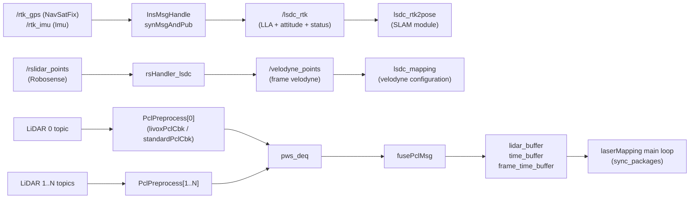

# preprocess Module — Source Architecture

| Item | Value |
|---|---|
| Module | preprocess |
| Applicable version | Follows `Spikive-SLAM` git `main` @ `c86c818` |
| Last updated | 2026-09-10 |

## 1. Overall structure

This module is the preprocessing subsystem inside the `lsdc_slam` package, composed of three mutually independent code blocks:

1. INS GPS/IMU time synchronization (node `ins_preprocess`);
2. Robosense-to-Velodyne-compatible format conversion (node `rs_converter`);
3. Single-scan parsing and multi-LiDAR fusion (compiled into the `lsdc_mapping` process; no standalone node).

There are no direct calls among the three blocks; the interface between block 3 and the LIO main loop of the SLAM module is in section 4.

## 2. Core classes / functions / data structures

### 2.1 `InsMsgHandle` (`src/preprocess/ins_preprocess.cpp:48`)

| Member | Responsibility |
|---|---|
| `gpsStatusOk` | GPS usability check: returns true when `status.status` is 48/49/50 (lines 58-61) |
| `pubRtkMsg` | Assembles `/lsdc_rtk`: `position.x/y/z` holds lat/lon/alt, `orientation` holds the INS attitude, `child_frame_id` is `OK` or `-` (lines 62-76) |
| `synMsgAndPub` | Dual-queue time sync: drops stale messages outside a ±0.05 s window; inside the window pairs the GPS message with the nearest IMU message and publishes (lines 79-112) |
| `imuCallback` / `gpsCallback` | Enqueue and trigger sync; `init_time` records the first message time |

Message semantics (non-standard `Odometry` usage, consistent with the repository's `docs/coordinate_frames.md`):

| Field | Semantics |
|---|---|
| `pose.pose.position.x/y/z` | latitude / longitude / altitude |
| `pose.pose.orientation` | INS attitude quaternion |
| `child_frame_id` | `"OK"` usable; `"-"` not usable (RTK state) |

### 2.2 `rsHandler_lsdc` (`src/preprocess/rs_to_velodyne.cpp:61`)

Processing steps:

1. Decodes the Robosense cloud (`RsPointXYZIRT`, defined at `pcl_struct.hpp:9`);
2. `has_nan` filters NaN points (lines 37-46);
3. extrinsic transform `pt = rs_to_avia_R * pt + rs_to_avia_T` (line 76); when `rs_to_avia_E` is non-zero, a Z-Y-X Euler rotation overrides the matrix first (lines 125-130);
4. ring remapping: 16-line uses `RING_ID_MAP_16` (indexed by `point_id / width`), 128-line uses `RING_ID_MAP_RUBY` (indexed by `point_id % height`) (lines 24-32, 86-90);
5. time remapping: `time = timestamp[i] - timestamp[0]` (relative to the first point, line 93);
6. publishes `/velodyne_points` with `frame_id = "velodyne"` (lines 49-59).

Point structures (`pcl_struct.hpp`):

| Structure | Fields |
|---|---|
| `RsPointXYZIRT` | x/y/z, `intensity`(uint8), `ring`(uint16), `timestamp`(double) |
| `VelodynePointXYZIRT` | x/y/z, `intensity`, `ring`(uint16), `time`(float) |
| `VelodynePointXYZIR` | x/y/z, `intensity`, `ring`(uint16) |

### 2.3 `Preprocess` (`src/LIO/preprocess.h:104`)

| Member | Responsibility |
|---|---|
| `process(CustomMsg)` | Livox entry; calls `avia_handler` (`preprocess.cpp:52-56`) |
| `process(PointCloud2)` | Standard cloud entry: converts the time scale by `time_unit`, dispatches by `lidar_type` to `oust64_handler`/`velodyne_handler`/`s10u_handler` (lines 58-96) |
| `avia_handler` | Livox CustomMsg parsing, blind filtering, thinning, feature extraction (from line 119) |
| `oust64_handler` | Ouster cloud parsing (from line 212) |
| `velodyne_handler` | Velodyne cloud parsing (from line 305) |
| `s10u_handler` | S10U parsing: FOV crop (`s10u_point_in_fov`), blind filtering, timestamp validation (offset within [-1, 200000] µs; points earlier than the timebase or with overlarge offsets are dropped), curvature field stores the relative millisecond offset for deskew (from line 471) |
| `s10u_point_in_fov` | computes vertical/horizontal angles via `atan2` and compares against half of `vertical_fov_degree` / `horizontal_fov_degree` (lines 98-117) |
| `give_feature` | feature classification: `plane_judge` (plane test), `small_plane` (small plane), `edge_jump_judge` (edge jump); results written to `orgtype.ftype` (from line 675) |
| `pub_func` | optionally publishes full/surface/corner clouds (from line 930) |

Data structures and enums (`preprocess.h`):

- `LID_TYPE`: `AVIA=1`, `VELO16=2`, `OUST64=3`, `S10U=4`;
- `TIME_UNIT`: `SEC=0`, `MS=1`, `US=2`, `NS=3`;
- `Feature`: `Nor`, `Poss_Plane`, `Real_Plane`, `Edge_Jump`, `Edge_Plane`, `Wire`, `ZeroPoint`;
- `orgtype`: per-point feature classification (`range`, `dista`, `angle[2]`, `intersect`, `edj[2]`, `ftype`);
- point structures: `velodyne_ros::Point`, `ouster_ros::Point`, `lx_ros::Point` (S10U, with `timestamp`(double), `row_pos`, `col_pos`);
- `PointType` = `pcl::PointXYZINormal` (curvature field reused as relative time offset).

### 2.4 namespace `pcl_pre` (`src/LIO/pcl_preprocess.hpp`)

| Class / function | Responsibility |
|---|---|
| `LidarFrameTimeInfo` | frame time info: `raw_header_time`, `point_min/max_offset_ms`, `point_min_time`, `point_end_time`, etc. |
| `PclWithStamp` | wrapper of a frame cloud + start/end stamps + time info |
| `PclPreprocess` | single-LiDAR preprocess instance; the constructor reads parameters with the `{type}_` prefix (lines 234-251); AVIA subscribes `livoxPclCbk`, others `standardPclCbk` |
| `PclPreprocess::transPclToMainLidar` | transforms this LiDAR's cloud into the main LiDAR frame using `{prefix}mapping/extrinsic_T/R` (lines 94-103) |
| `PclPreprocess::buildFrameTimeInfo` | computes min/max per-point time offsets from the curvature field (lines 105-133) |
| `PclPreprocess::updateLidarImuTimeDiff` | when `common/time_sync_en` is true, estimates and fixes the LiDAR-IMU time offset (lines 135-144) |
| `livoxPclCbk` / `standardPclCbk` | timestamp-regression detection (queue clear), frame preprocessing, extrinsic transform, push to `pws_deq`, trigger `fusePclMsg` |
| `fusePclMsg` | multi-LiDAR fusion: uses the frame time window of LiDAR 0, merges in-window points of the other LiDARs, writes into the global `lidar_buffer`, `time_buffer`, `frame_time_buffer` (lines 266-312) |
| `initPclPrepreocess` | parses the `-`-separated LiDAR type string and creates multiple `PclPreprocess` instances (lines 323-330) |

Shared buffers (`extern`, defined by `laserMapping.cpp`): `lidar_buffer`, `time_buffer`, `frame_time_buffer`, plus the condition variable `sig_buffer` and mutex `mtx_buffer`. The LIO main loop takes frames from these buffers via `sync_packages`.

## 3. Call chains and data flow

## 4. Module interfaces and dependencies

| Direction | Target | Interface |
|---|---|---|
| Upstream | GPS/INS device drivers | `/rtk_gps`, `/rtk_imu` |
| Upstream | Robosense driver | `/rslidar_points` |
| Upstream | `livox_ros_driver` | `CustomMsg` topic (`{prefix}common/lid_topic`) |
| Downstream | `lsdc_rtk2pose` (SLAM module) | `/lsdc_rtk` |
| Downstream | `lsdc_mapping` (SLAM module) | `/velodyne_points`; in-process shared buffers `lidar_buffer` etc. |

Libraries: GeographicLib (linked by `ins_preprocess`), PCL, Eigen, OpenCV (variable reference in `rs_velodyne`).

## 5. Key configuration

| Config group | Parameters | Meaning |
|---|---|---|
| `ins` | `gps_topic`, `imu_topic` | INS node input topics |
| `mapping` | `rs_to_avia_T`, `rs_to_avia_E`, `rs_to_avia_R` | Robosense-to-main-LiDAR extrinsic (undefined in delivered configs; default identity) |
| `{prefix}preprocess` | `lidar_type`, `scan_line`, `blind`, `feature_extract_enable`, `point_filter_num`, `timestamp_unit`, `scan_rate`, `fov_crop_enable`, `vertical_fov_degree`, `horizontal_fov_degree` | per-scan preprocessing parameters (`pcl_preprocess.hpp:234-246`) |
| `{prefix}common` | `lid_topic` | topic of this LiDAR |
| `{prefix}mapping` | `extrinsic_T`, `extrinsic_R` | extrinsic of this LiDAR relative to the main LiDAR |
| `common` | `time_sync_en` | LiDAR-IMU time-offset self-estimation switch (`pcl_preprocess.hpp:136`) |

Per-model values are in the SLAM module's `architecture.md` section 6.2 table.

## 6. Pending items (scope of this page)

1. `config/velodyne.yaml` names `ins/ins_gps_topic` / `ins/ins_imu_topic` while this node reads different parameters.
2. `mapping/rs_to_avia_*` is undefined in delivered configs; whether the default identity extrinsic matches on-site calibration.

All are collected in `docs/en/appendix/pending-items.md`.
