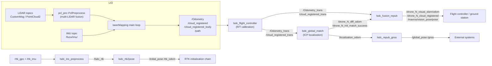

# SLAM Module — Source Architecture

| Item | Value |
|---|---|
| Module | SLAM |
| Applicable version | `Spikive-SLAM` git `main` @ `c86c818` (`lsdc_slam` 0.0.0) |
| Last updated | 2026-09-10 |

## 1. Overall structure

This package is a single catkin package that builds 9 executables, one entry point per ROS node. The executable-to-source mapping is defined at `CMakeLists.txt:100-135`:

| Executable | Sources | Extra linked libraries |
|---|---|---|
| `rs_velodyne` | `src/preprocess/rs_to_velodyne.cpp` | PCL, OpenCV (variable reference, see docker-build.md section 8) |
| `lsdc_mapping` | `src/LIO/laserMapping.cpp`, `include/ikd-Tree/ikd_Tree.cpp`, `src/LIO/preprocess.cpp` | PCL, Python |
| `lsdc_ins_preprocess` | `src/preprocess/ins_preprocess.cpp` | GeographicLib |
| `lsdc_flight_controller` | `src/localization/flight_controller.cpp` | PCL, Ceres |
| `lsdc_repub_gnss` | `src/RTK/repub_gnss.cpp` | GeographicLib |
| `lsdc_rtk2pose` | `src/RTK/rtk2pose.cpp` | GeographicLib, Ceres |
| `lsdc_global_match` | `src/localization/global_match.cpp` | PCL, Ceres |
| `lsdc_fusion_repub` | `src/localization/fusion_repub.cpp` | PCL, Ceres |
| `lsdc_save_result` | `src/LIO/save_result.cpp` | catkin only |

Five layers (this repository's `docs/architecture.md`): sensor preprocessing, LIO mapping, RTK initialization, Motion Control calibration adapter, Localization / world output.

## 2. Directory and file responsibilities

| File / directory | Responsibility |
|---|---|
| `src/LIO/laserMapping.cpp` | main of node `lsdc_mapping` (node name `laserMapping`); LIO main loop |
| `src/LIO/IMU_Processing.hpp` | `ImuProcess`: IMU init, forward propagation, scan undistortion |
| `src/LIO/preprocess.h` / `.cpp` | `Preprocess`: single-LiDAR scan parsing and feature extraction (details in the preprocess module docs) |
| `src/LIO/pcl_preprocess.hpp` | namespace `pcl_pre`: multi-LiDAR config reading, extrinsic transforms, multi-LiDAR frame fusion (details in the preprocess module docs) |
| `src/LIO/save_result.cpp` | node `lsdc_save_result`: bag recorder; the legacy ENU logic is kept commented out in `legacyMain` |
| `src/localization/flight_controller.cpp` | node `lsdc_flight_controller`: calibrated extrinsic transform; publishes `/Odometry_trans`, `/cloud_registered_trans` |
| `src/localization/fusion_repub.cpp` | node `lsdc_fusion_repub`: publishes stable topics and MAVROS topics based on localization state |
| `src/localization/global_match.cpp` | node `lsdc_global_match`: ICP localization against the WayPoint map |
| `src/preprocess/` | `ins_preprocess.cpp`, `rs_to_velodyne.cpp`, `pcl_struct.hpp` (see the preprocess module docs) |
| `src/RTK/rtk2pose.cpp` | Converts RTK LLA to local pose and initial pose |
| `src/RTK/repub_gnss.cpp` | Back-computes lat/lon from the local pose and republishes |
| `include/common_lib.h` | Type aliases (`V3D`, `PointType` …), macros (`G_m_s2`, `DEBUG_FILE_DIR` …), structs `StatesGroup`, `MeasureGroup` |
| `include/use-ikfom.hpp` | `state_ikfom` manifold (23-dim), `input_ikfom`, transition `get_f`/`df_dx`/`df_dw` |
| `include/so3_math.h`, `Exp_mat.h` | SO3 math utilities |
| `include/lsdc_geo.hpp` | `LsdcGeographicLib`: GeographicLib wrapper, LLA ↔ local coordinates |
| `include/lsdc_math.hpp`, `lsdc_tools.hpp`, `odom_struct.hpp` | SE3 utilities, voxel downsampling, odom struct wrappers |
| `include/ikd-Tree/` | hku-mars incremental KD-tree (`KD_TREE`); the source is compiled directly into `lsdc_mapping` |
| `include/IKFoM_toolkit/` | hku-mars manifold Kalman filter toolkit (`esekfom::esekf`, `dyn_share_datastruct`) |
| `include/Commons/` | Geographic header set (`LocalGeographicCS.hpp`, `WGS84toCartesian.hpp`, `convert_coordinates.hpp`, …) |
| `include/matplotlibcpp.h` | Third-party single-header library (embedded Python plotting from C++) |
| `msg/` | `Pose6D.msg` (preintegrated LiDAR state), `bywire_chassis_state.msg` (chassis state) |
| `config/` | Parameter files (see section 6) |
| `launch/` | Scenario orchestration (see `commandline.md`) |
| `Lsdc_Repub/` | Runtime pose record directory; `rtk2pose.cpp` and `repub_gnss.cpp` read/write `last_pose.txt` and `pose_init.txt` |

## 3. Core classes / functions / data structures

### 3.1 `lsdc_mapping` (`src/LIO/laserMapping.cpp`)

- Parameter loading (`main`, lines 845-878): `publish/*`, `common/*`, `mapping/*`, `pcd_save/*`, `runtime_pos_log_enable`; line 882 reads `argv[1]` as the LiDAR type string (multiple LiDARs separated by `-`) and passes it to `pcl_pre::initPclPrepreocess`.
- Data structures:
  - `state_ikfom` (`use-ikfom.hpp`): 23-dim state (position, rotation, IMU-LiDAR extrinsics, velocity, gyro/accel biases, gravity);
  - `KD_TREE` (ikd-Tree): incremental KD-tree map;
  - `PointType` (`preprocess.h`): `PointXYZINormal` (curvature field reused as time offset).
- Main loop:
  1. `sync_packages`: IMU / point-cloud time alignment (incl. S10U frame time checks);
  2. `ImuProcess::Process`: forward propagation + backward deskew (`IMU_init`, `UndistortPcl` in `IMU_Processing.hpp`);
  3. voxel downsampling;
  4. `lasermap_fov_segment`: local map cube sliding and ikd-Tree deletion;
  5. `h_share_model`: nearest-surface search, plane residuals and Jacobians;
  6. `kf.update_iterated_dyn_share_modified`: iterated Kalman update (`esekfom`);
  7. `map_incremental`: ikd-Tree incremental mapping;
  8. publishes `/Odometry` (`camera_init`→`body`), `/cloud_registered`, `/cloud_registered_body`, `/path`.
- Interface with `Preprocess`/`PclPreprocess`: point-cloud callbacks in namespace `pcl_pre` write into the shared `lidar_buffer`; the main loop takes frames from it (details in the preprocess module docs).

### 3.2 `lsdc_flight_controller` (`src/localization/flight_controller.cpp`)

- `validateExtrinsic`: validates size, finiteness, orthogonality and `det(R)` of global parameters `R`, `T`; the node exits when invalid.
- Odometry transform: SE3 conjugation `trans_odom = D * lio_odom * D^-1`, translation plus the private `init_x/y/z` offset; cloud transform: `point_world = R * point + T + init_translation`.
- Output: `/Odometry_trans`, `/cloud_registered_trans` (frame `world`).

### 3.3 `lsdc_fusion_repub` (`src/localization/fusion_repub.cpp`)

- Subscribes to `/Odometry_trans`, `/cloud_registered_trans`, `/drone_{id}_diff_odom`, `/drone_{id}_init_match_success`.
- Output logic (consistent with `docs/coordinate_frames.md`):

```text
if init_match_success is true:
    stable_odom  = diff_odom * calibrated_odom
    stable_cloud = diff_odom * calibrated_cloud
else:
    stable_odom  = calibrated_odom
    stable_cloud = calibrated_cloud
```

- Publishes: `/drone_{id}_visual_slam/odom`, `/drone_{id}_cloud_registered`, `/localization_odom`, `/localization_cloud_registered`, `/mavros/vision_pose/pose`, `/mavros/companion_process/status` (component=197).

### 3.4 `lsdc_global_match` (`src/localization/global_match.cpp`)

- Parameters: `localization/*` (`match_freq`, `filter_size_map/src`, `fov_far/ang`, `max_iteration`, `fitness_threshold`, `success_confirm_count`, `match_timeout_sec`, `status_publish_period_sec`, `continuous_match`, `initial_pose_is_world`, `display_matching_time`, `debug_do_not_match`).
- State machine: `idle → map_loaded → waiting_initialpose → matching → localized / failed` (see `commandline.md` section 6).
- Correction: `T_diff_guess = T_initial_world * inverse(T_calibrated_current)`.
- `runIcp`: three-resolution ICP (scale 10/5/1); after `success_confirm_count` consecutive successes it publishes `/drone_{id}_diff_odom`, `/drone_{id}_init_match_success` (latched), `/drone_{id}_localization_match_status` (JSON).
- Also publishes `/map`, `/submap` (latched map), `/fov_sphere_marker` (visualization).

### 3.5 `lsdc_rtk2pose` (`src/RTK/rtk2pose.cpp`)

- Subscribes to `/lsdc_rtk`; uses `lsdc::LsdcGeographicLib` (`include/lsdc_geo.hpp`) for LLA→local odom conversion; when RTK is invalid (`child_frame_id=="ERROR"`) it falls back to reading `Lsdc_Repub/last_pose.txt`.
- Publishes `/initial_pose` (`PoseWithCovarianceStamped`, frame `map`), `/rtk_odom`, `/rtk_path` at 0.5 s; writes Origin/Init/Delta Pose into `pose_init.txt`.
- Parameters: `rtk/use_map_origin`, `rtk/frame_id` (default `camera_init`), `input_path` (default `ROOT_DIR + "Lsdc_Repub/"`).

### 3.6 `lsdc_repub_gnss` (`src/RTK/repub_gnss.cpp`)

- Subscribes to `/localization_odom`, `/Odometry`, `/ins_lla`, `/bywire_chassis`, `/init_match_success`.
- After localization success, back-computes lat/lon from the local pose via `LsdcGeographicLib::getRtkFromOdom`, publishes `/global_pose` (`PoseStamped`, position holds LLA) and `/gnss` (`NavSatFix`); writes lat/lon + quaternion to `Lsdc_Repub/last_pose.txt`.
- `judgeState`: reserved vehicle-speed consistency check, currently always returns true.

### 3.7 `lsdc_ins_preprocess`, `rs_velodyne`, `Preprocess`, `PclPreprocess`

See the preprocess module docs at `docs/en/preprocess/architecture.md`.

### 3.8 `lsdc_save_result` (`src/LIO/save_result.cpp`)

- Current `main` is a bag recorder: private parameters `drone_id`, `visual_odom_topic`, `save_dir`; subscribes to `/drone_{id}_bag_record_start`, `_stop`; records `/cloud_registered_body`, `/Odometry_trans`, visual odometry and IMU; writes `.active.bag` then renames to `.bag`; publishes `/drone_{id}_bag_record_status`.
- `legacyMain` (ENU outputs `/Odometry_enu`, `/rtk_odom_enu`, `/pcl_map`, `/initial_pose` subscription) is kept entirely in comments and is not compiled.

## 4. Call chains and data flow



The RTK chain and the LIO chain are independent; `lsdc_repub_gnss` input comes from `lsdc_global_match` state and `/Odometry`.

## 5. Module interfaces and dependencies

| Direction | Target | Interface |
|---|---|---|
| Upstream | `livox_ros_driver` | LiDAR topic (`{prefix}common/lid_topic`), IMU topic (`common/imu_topic`) |
| Upstream | Robosense driver | `/rslidar_points` (converted by `rs_velodyne` into the velodyne chain) |
| Upstream | Flight controller | `/mavros/imu/data` (`mapping_s10u_mavros.launch` scenario) |
| Downstream | `Spikive-PGO` (`spikive_btc`) | `/cloud_registered_body`, `/Odometry` (online input config of `Spikive-PGO/launch/slam_btc.launch`) |
| Downstream | WayPoint backend / frontend | subscribes to `/drone_{id}_localization_pcl`; is subscribed on `/drone_{id}_initialpose` |
| Downstream | Flight controller / ground station | `/drone_{id}_visual_slam/odom`, `/drone_{id}_cloud_registered`, `/mavros/vision_pose/pose`, `/mavros/companion_process/status` |
| External package | `lsdc_forward` | 3 launch files reference its `lsdc_forward_node`; this package does not build it [TBC] |

Libraries: Eigen3, Ceres, PCL (≥1.8), GeographicLib, PythonLibs, mavros, mavros_msgs, livox_ros_driver, OpenMP (optional).

## 6. Key configuration

### 6.1 `config/config.yaml`

| Group | Parameters | Meaning |
|---|---|---|
| `common` | `imu_topic`, `max_iteration`, `filter_size_surf`, `filter_size_map`, `cube_side_length` | IMU topic, iteration count, map/scan voxel filter sizes, local map cube side length |
| `mapping` | `acc_cov`, `gyr_cov`, `b_acc_cov`, `b_gyr_cov` | Accel/gyro noise and bias covariances |
| `mapping` | `fov_degree`, `det_range` | Field of view, valid range |
| `mapping` | `extrinsic_est_en`, `extrinsic_T`, `extrinsic_R` | IMU-LiDAR extrinsic online-estimation switch and initial extrinsic |
| `publish` | `path_en`, `scan_publish_en`, `dense_publish_en`, `scan_bodyframe_pub_en`, `state_print_en` | Path/cloud publish switches, body-frame cloud switch, state printing |
| `pcd_save` | `pcd_save_en`, `interval`, `save_result_en`, `enu_results`, `save_path`, `save_name` | PCD save switch, frames per file, ENU output, save path |
| `ins` | `gps_topic`, `imu_topic` | INS node input topics |
| top-level | `R`, `T` | Extrinsic from LiDAR frame to motion center (used by `lsdc_flight_controller`) |
| `localization` | `match_freq`, `filter_size_map/src`, `fov_far/ang`, `max_iteration`, `fitness_threshold`, `success_confirm_count`, `match_timeout_sec`, `status_publish_period_sec`, `continuous_match`, `initial_pose_is_world`, `display_matching_time`, `debug_do_not_match` | `lsdc_global_match` matching parameters |

### 6.2 Per-LiDAR configs

| File | Key differences |
|---|---|
| `config_avia.yaml` | `avia_common/lid_topic=/livox/lidar`; `feature_extract_enable=true`; `extrinsic_T=[0.05783, 0, -0.06532]` (Liuzhou plant comment) |
| `config_mid360.yaml` | `lid_topic=/livox/lidar_192_168_1_128`; `blind=2`; identity extrinsic |
| `config_mid70.yaml` | `lid_topic=/livox/lidar`; `extrinsic_T=[0.044, 0, -0.08622]` (Liuzhou mid70+mid360 comment) |
| `config_s10u.yaml` | `lidar_type=4`, `scan_line=160`, `timestamp_unit=2`, `scan_rate=10`, FOV crop (`vertical_fov_degree=90`, `horizontal_fov_degree=120`), `fov_degree=120`, `det_range=90`, `extrinsic_est_en=false` |
| `config_s10u_mavros.yaml` | Same as S10U; `common/time_sync_en=true`, `lid_topic=/LxCamera_LidarCloud`, `mapping/extrinsic_R` is the rotation from camera coordinates to `base_link` |
| `velodyne.yaml` | `lidar_type=2`, `scan_line=16`, `extrinsic_E=[-0.0446, 4.19977, -0.601616]`, `pcd_save_en=true`; `ins: ins_gps_topic/ins_imu_topic` |
| `config_velodyne.yaml` | `rtk` group (RTK extrinsics plus `use_map_origin`, `frame_id`), `localization` group (`map_address=MAP/pgo_map.pcd`, `origin_L`, `origin_Q`) |

LiDAR type values: 1=Livox series, 2=Velodyne, 4=S10U (`config/velodyne.yaml` line 8 comment and `config_s10u.yaml`).

### 6.3 Parameter precedence

Launch-file `<param>` entries are written after `rosparam load`, so `common/imu_topic` in `mapping_s10u.launch` overrides the value in `config.yaml`.

## 7. Coordinate frames

The authoritative description is this repository's `docs/coordinate_frames.md`. Key points:

| Frame / expression | Meaning |
|---|---|
| `body` | IMU/body coordinates (`/Odometry.child_frame_id`, `/cloud_registered_body.header.frame_id`) |
| `camera_init` | LIO mapping world frame (`/Odometry.header.frame_id`) |
| `map` | WayPoint map coordinates (used inside `lsdc_global_match`) |
| `world` | Stable output frame; before localization success it is the fallback startup world, afterwards the WayPoint map world |
| `base{id}` | Ground-station 3D follow frame, published by planner / odom_visualization, not by SLAM |
| WGS84 LLA | RTK/INS lat/lon expression |

LIO internal coordinate chain: `raw LiDAR point → per-lidar extrinsic (pcl_preprocess.hpp) → IMU/body frame → state.rot * (offset_R_L_I * p + offset_T_L_I) + state.pos → camera_init`.

## 8. Pending items (scope of this page)

1. `lsdc_init_pose`: referenced by launch files but has no source file or build target.
2. `lsdc_forward_node`: external package dependency.
3. Combination of `mapping_velodyne.launch` starting `lsdc_mapping` without `args` and `laserMapping.cpp:882` reading `argv[1]`.
4. `uav.launch` and `config_a.yaml` mentioned in `docs/data_flow.md` do not exist in the current tree.
5. `legacyMain` of `lsdc_save_result` (ENU output chain) is commented out; availability of the PGO default inputs `/Odometry_enu` and `/rtk_odom_enu` depends on whether that chain is restored.

All are collected in `docs/en/appendix/pending-items.md`.
