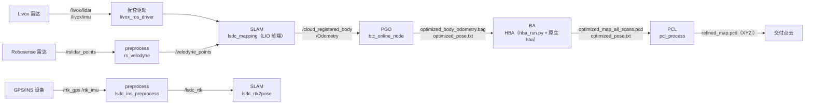

# 系统总览：模块间接口与全链路数据流

| 项 | 值 |
|---|---|
| 模块名 | 附录（跨模块） |
| 适用版本 | 全部 5 模块（版本见总索引第 2 节） |
| 最后更新 | 2026-09-10 |

## 1. 全链路数据流

preprocess 模块的三个块在链路中的位置：

| 块 | 位置 |
|---|---|
| `lsdc_ins_preprocess` | 独立支路：GPS/IMU 同步后输出 `/lsdc_rtk`，供 SLAM 的 RTK 初始化链 |
| `rs_velodyne` | velodyne 场景支路：Robosense 点云转换为 `/velodyne_points` 后进入 `lsdc_mapping` |
| `Preprocess` / `PclPreprocess` | LIO 前端内部环节，编入 `lsdc_mapping` 进程 |

## 2. 模块间接口（话题级）

| 上游模块 | 接口 | 下游模块 | 契约出处 |
|---|---|---|---|
| 配套驱动 | `/livox/lidar`（CustomMsg/PointCloud2）、`/livox/imu` | SLAM | `lsdc_slam` 的 `{前缀}common/lid_topic`、`common/imu_topic` |
| preprocess | `/lsdc_rtk` | SLAM（`lsdc_rtk2pose`） | `ins_preprocess.cpp` |
| preprocess | `/velodyne_points` | SLAM（`lsdc_mapping`） | `rs_to_velodyne.cpp` |
| SLAM | `/cloud_registered_body`（frame `body`）、`/Odometry`（`T_camera_init_body`） | PGO | `Spikive-PGO/docs/frame_contract.md` |
| SLAM | `/drone_{id}_visual_slam/odom`、`/drone_{id}_cloud_registered`、`/mavros/*` | 飞控 / 地面站 | `lsdc_fusion_repub` |

## 3. 模块间接口（文件级）

| 上游 | 文件 | 下游 | 约束 |
|---|---|---|---|
| PGO | `optimized_body_odometry.bag` | BA | 话题 `/cloud_registered_body`（frame `body`）；由 BA 的 `hba_inputs.py` 校验 |
| PGO | `optimized_pose.txt` | BA | TUM 格式 `timestamp tx ty tz qx qy qz qw`，`T_world_body`，默认世界系 `camera_init` |
| BA | `optimized_map_all_scans.pcd` | PCL | HBA 全扫描顺序拼接 XYZI（FLOAT32），未经第三方软件重排/采样 |
| BA | `optimized_pose.txt` | PCL | 同上 TUM 格式，纳秒时间戳与点云一一对应 |
| BA | 原始 body bag | PCL | 生成 HBA 结果时使用的原始 bag（`/cloud_registered_body`） |
| PCL | `refined_map.pcd` | 交付 | FLOAT32 `x y z intensity` |

## 4. 镜像与环境总表

| 镜像 | 构建入口 | 用途 | GTSAM |
|---|---|---|---|
| `spikive-slam:btc-noetic` | `Spikive-PGO/scripts/dev.sh build-image` | SLAM、preprocess、配套驱动、PGO 的编译与运行 | 4.2.0（`/opt/spikive`） |
| `spikive-ba-env:gtsam411` | `Spikive-BA/scripts/hba.sh build-env` | BA 依赖镜像；也是 PCL 主镜像的基础 | 4.1.1（`/opt/hba-gtsam411`） |
| `spikive-ba:v1.0.0-w20-g10` | `Spikive-BA/scripts/hba.sh build-image` | BA 运行 | 4.1.1 |
| `spikive-pcl-process:1.0.0` | `Spikive-Pcl-Process/scripts/process.sh build` | PCL 运行 | 无（不依赖 GTSAM） |

镜像之间无共享 GTSAM 缓存；PGO 与 BA 使用不同 GTSAM 版本，分别隔离在各自镜像与构建前缀中（`Spikive-BA/README.md` 原文）。

## 5. 端到端运行顺序

按以下顺序操作，每步命令与判读见对应模块文档：

| 步骤 | 操作 | 文档 |
|---|---|---|
| 1 | 构建三个镜像（PGO 镜像覆盖 SLAM/preprocess/驱动编译环境） | `pgoba/docker-build.md`、`pcl/docker-build.md` |
| 2 | 启动 Livox 驱动 | `driver-livox/commandline.md` |
| 3 | 启动 LIO 前端（含 preprocess） | `slam/commandline.md` |
| 4 | 回放或在线运行 PGO，EOF 后导出 | `pgoba/commandline.md` 第一部分 |
| 5 | 运行 HBA 全局 BA | `pgoba/commandline.md` 第二部分 |
| 6 | 运行点云精修 | `pcl/commandline.md` |

步骤 2-3 为在线链路；步骤 4-6 为离线链路，按文件接口衔接（见第 3 节）。

## 6. 数据目录约定

| 目录 | 说明 |
|---|---|
| `Spikive-PGO/results/` | PGO 输出（`SPIKIVE_RESULTS_DIR` 可重定向；容器内为 `/results`） |
| `Spikive-PGO/.dev/` | PGO 构建状态与实验数据（Git 忽略） |
| `Spikive-BA/.dev/hba/` | BA 工作缓存（`HBA_STATE_DIR` 可重定向；中间逐帧 PCD 位于 `work/`） |
| PCL `NEW_OUTPUT_DIR` | PCL 输出目录，必须不存在，每次新建 |
| `Spikive-PGO/scripts/dev.sh` 的 `SPIKIVE_STATE_DIR` | 默认 `.dev/standalone`（build/devel/workspace） |

## 7. 交付包中不存在的内容

| 内容 | 说明 |
|---|---|
| 构建快照与实验数据（清点阶段的 `.dev/`，约 9.9 GB） | 交付前已从源码包移除 |
| `experiments/native_comparison/` | 空目录骨架（0 文件） |
| FastLIO 以外的 SLAM 前端源码 | PGO 容器不包含前端源码（`Spikive-PGO/README.md` 原文）；前端为 `Spikive-SLAM` |
| 外部包 `lsdc_forward` | 被 SLAM 的 3 个 launch 引用，不在交付范围（见待确认清单） |
