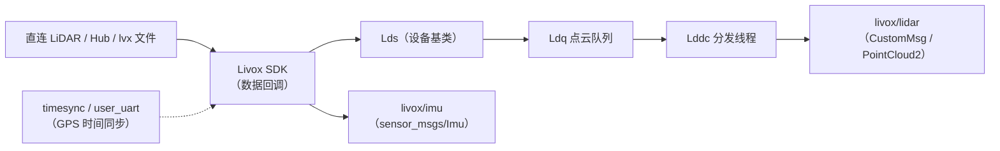

# 配套驱动模块源码级架构说明

| 项 | 值 |
|---|---|
| 模块名 | 配套驱动（livox_ros_driver） |
| 适用版本 | `livox_ros_driver` git `master` @ `3d240d5`（2.6.0） |
| 最后更新 | 2026-09-10 |

## 1. 总体结构

单 ROS 节点 `livox_lidar_publisher`（可执行 `livox_ros_driver_node`）。数据流：数据源（直连雷达 / Hub / lvx 文件）→ Livox SDK 回调 → 点云队列 → 分发线程 → ROS 话题。

| 层 | 文件 |
|---|---|
| main 入口 | `livox_ros_driver/livox_ros_driver/livox_ros_driver.cpp` |
| 设备抽象 | `lds.{cpp,h}`（`Lds` 基类，统一设备回调入口） |
| 数据源 | `lds_lidar.{cpp,h}`（直连）、`lds_hub.{cpp,h}`（Hub）、`lds_lvx.{cpp,h}`（lvx 文件） |
| 点云队列 | `ldq.{cpp,h}` |
| 点云分发 | `lddc.{cpp,h}`（发布器与话题名管理） |
| lvx 文件解析 | `lvx_file.{cpp,h}` |
| 通信协议 | `common/comm/`（`comm_protocol`、`sdk_protocol`、`gps_protocol`、`comm_device.h`） |
| 时间同步 | `timesync/timesync.{cpp,h}`、`timesync/user_uart/`（GPS 时间戳同步，经串口 `comm_device_type`） |
| 第三方 | `common/FastCRC/`、`common/rapidjson/`、`common/rapidxml/` |

## 2. 核心类 / 函数

| 类 / 函数 | 位置 | 职责 |
|---|---|---|
| `main` | `livox_ros_driver.cpp:54` | 解析命令行广播码、读取参数、检查 SDK 版本（`kSdkVersionMajorLimit=2`）、按 `data_src` 选择数据源、启动收发 |
| `Lds` | `lds.{cpp,h}` | 设备基类：保存 SDK 初始化结果、设置 `LidarDataCallback`/`ImuDataCallback` 等回调 |
| `LdsLidar` / `LdsHub` / `LdsLvx` | `lds_lidar.{cpp,h}` 等 | 三类数据源的初始化与数据接入 |
| `Lddc` | `lddc.{cpp,h}` | 点云分发：`GetCurrentPublisher`/`GetCurrentImuPublisher` 按 `multi_topic` 返回话题名；组装 `CustomMsg`/`PointCloud2` 并发布 |
| `Ldq` | `ldq.{cpp,h}` | 点云队列缓冲 |
| `lvx_file` | `lvx_file.{cpp,h}` | lvx 帧头解析与数据读取 |

## 3. 数据流

## 4. 话题与消息格式

| 项 | 说明 |
|---|---|
| 点云话题 | `multi_topic=0`：`livox/lidar`；`multi_topic=1`：`livox/lidar_<广播码>` |
| 点云格式 | `xfer_format=0`：`PointCloud2`（自定义 `PointXYZRTL` 布局）；`=1`：`livox_ros_driver/CustomMsg`；`=2`：pcl `PointXYZI` 的 `PointCloud2` |
| IMU 话题 | `livox/imu`（`multi_topic=1` 时 `livox/imu_<广播码>`），固定 `sensor_msgs/Imu` |
| frame_id | 点云默认 `livox_frame`（launch `msg_frame_id`）；IMU 硬编码 `livox_frame`（`lddc.cpp:487`） |
| `CustomMsg` | `header`、`timebase`(uint64)、`point_num`(uint32)、`lidar_id`(uint8)、`rsvd`(uint8[3])、`points[]` |
| `CustomPoint` | `offset_time`(uint32)、`x/y/z`(float32)、`reflectivity`(uint8)、`tag`(uint8)、`line`(uint8) |

## 5. 模块间接口与依赖关系

| 方向 | 对象 | 接口 |
|---|---|---|
| 下游 | SLAM 模块（`lsdc_slam`） | 点云话题（`{前缀}common/lid_topic` 订阅，`CustomMsg`）、IMU 话题（`common/imu_topic`） |
| 编译下游 | `lsdc_slam` | 依赖本包消息头 `<livox_ros_driver/CustomMsg.h>`（`Spikive-SLAM/src/preprocess/ins_preprocess.cpp:6`、`src/LIO/preprocess.h:3`） |
| 运行时依赖 | Livox SDK ≥ 2 | `livox_ros_driver.cpp:40,62` 启动检查 |
| 库依赖 | Boost、PCL、apr-1 | `CMakeLists.txt` |

## 6. 关键配置项

| 配置 | 位置 | 关键字段 |
|---|---|---|
| `livox_lidar_config.json` | `config/` | `lidar_config[]`（`broadcast_code`、`enable_connect`、`return_mode`、`coordinate`、`imu_rate`、`extrinsic_parameter_source`、`enable_high_sensitivity`）；`timesync_config`（`enable_timesync`、`device_name`、`comm_device_type`、`baudrate_index`、`parity_index`） |
| `livox_hub_config.json` | `config/` | `hub_config`（`broadcast_code`、`enable_connect`、`coordinate`）；`lidar_config[]`（4 台雷达） |
| launch 参数 | 9 个 launch 文件 | `xfer_format`、`multi_topic`、`data_src`、`publish_freq`、`bd_list`、`msg_frame_id` 等（见 `commandline.md`） |

设备侧参数（`return_mode`、`imu_rate`、时间同步）由 SDK 在连接时按 JSON 配置下发；本包不修改 SDK 数据内容。

## 7. 维护说明

- 本包为官方未修改克隆（证据见本模块 `README.md` 第 1 节）；对驱动行为的修改应以补丁或升级上游版本方式进行，不直接改动 vendor 树。
- 上游仓库：`https://github.com/Livox-SDK/livox_ros_driver.git`，锁定提交 `3d240d5`（`sources.repos`）。
- 消息格式变更会同时影响 `lsdc_slam` 的 `preprocess` 解析（`src/LIO/preprocess.cpp` 的 `avia_handler`），修改前需联调。
