# Spikive SLAM Pipeline 交接文档（总索引）

| 项 | 值 |
|---|---|
| 模块名 | 总索引（覆盖 SLAM、PGOBA、PCL、preprocess、配套驱动 5 个模块） |
| 适用版本 | 源码包 `src.zip` 交付快照（解压根：`src/src/`），2026-09-06 克隆、2026-09-10 交付 |
| 最后更新 | 2026-09-10 |

## 1. 文档用途与范围

本文档集面向客户方工程师，用于：

1. 按命令行步骤运行各模块；
2. 在 Docker 环境中编译各模块；
3. 理解源码架构并进行维护。

覆盖范围固定为 5 个模块：SLAM、PGOBA、PCL、preprocess、配套驱动。每个模块的文档均包含三节：命令行使用、Docker 环境编译说明、源码级架构说明。

本文档集是站点内容来源（底层文件）：中文位于 `docs/zh/`，英文位于 `docs/en/`。内容维护约定见仓库根 `README.md`。

## 2. 项目组成与版本

| 模块 | 源码目录 | 包 / 工程名 | 版本 | 版本锁定 |
|---|---|---|---|---|
| SLAM | `Spikive-SLAM/` | ROS 包 `lsdc_slam` | `package.xml` 声明 `0.0.0` | git `main` @ `c86c818`（clone 自 `QGDuan/Spikive-SLAM`） |
| PGOBA（PGO） | `Spikive-PGO/` | ROS 包 `spikive_btc` | `0.1.0` | git `dev` @ `3560a85`；`sources.repos` 锁定分支 `dev` |
| PGOBA（BA） | `Spikive-BA/` | ROS 包 `spikive_ba` | `1.0.0` | git `main` @ `35324cb`；`sources.repos` 锁定同提交（标注 v1.0.0） |
| PCL | `Spikive-Pcl-Process/` | CMake 工程 `spikive_pcl_process` | `1.0.0`（`VERSION` 文件） | git `main` @ `249b488`；未列入 `sources.repos` |
| preprocess | `Spikive-SLAM/src/preprocess/`、`Spikive-SLAM/src/LIO/preprocess.*` | `lsdc_slam` 内子系统 | 随 SLAM 仓库 | 随 SLAM 仓库 |
| 配套驱动 | `livox_ros_driver/` | ROS 包 `livox_ros_driver` | `2.6.0` | git `master` @ `3d240d5`；`sources.repos` 锁定同提交 |

说明：

- 源码路径均以源码根 `src/src`（含上述仓库的目录）为基准；本文档自身路径以本仓库根为基准。
- preprocess 无独立仓库，其源码位于 `Spikive-SLAM` 仓库内。本文档将其作为独立模块文档编写，源码路径标注实际位置。
- 源码根另有 `experiments/`（空目录骨架，无文件）、`reports/`（调研报告）。清点阶段曾存在 `.dev/` 目录（构建快照与回放数据），交付前已从源码包移除；交付包不含构建快照与实验数据。

## 3. 端到端数据流

```mermaid
flowchart LR
    A["Livox 雷达"] -->|"/livox/lidar<br>/livox/imu"| B["livox_ros_driver<br>节点 livox_lidar_publisher"]
    B --> C["Spikive-SLAM · lsdc_mapping<br>（LIO 前端，含雷达帧预处理）"]
    C -->|"/cloud_registered<br>/Odometry"| D["lsdc_flight_controller<br>（飞控外参变换）"]
    D -->|"/cloud_registered_trans<br>/Odometry_trans"| E["lsdc_fusion_repub<br>（稳定话题转发）"]
    E -->|"/drone_N_visual_slam/odom<br>/drone_N_cloud_registered"| F["Spikive-PGO · btc_online_node<br>（BTC 回环 + GICP + PCM/GNC + iSAM2）"]
    F -->|"optimized_body_odometry.bag<br>optimized_pose.txt"| G["Spikive-BA · HBA<br>（分层全局 BA）"]
    G -->|"optimized_map_all_scans.pcd<br>optimized_pose.txt"| H["Spikive-Pcl-Process · pcl_process<br>（SOR/MLS/TSDF 表面精修）"]
    H -->|"refined_map.pcd（XYZI）"| I["交付点云"]
```

preprocess 节点在线路上的位置：

- `lsdc_ins_preprocess`：订阅 `ins/gps_topic` 与 `ins/imu_topic`，时间同步后发布 `/lsdc_rtk`，供 RTK 初始化链（`lsdc_rtk2pose`）使用；
- `rs_velodyne`：把 Robosense 点云转换为 `/velodyne_points`，供 velodyne 配置的 `lsdc_mapping` 使用；
- `Preprocess`/`PclPreprocess`（编入 `lsdc_mapping`）：对 Livox/Ouster/Velodyne/S10U 雷达帧做解析、时间戳转换、盲区过滤、抽稀、特征提取与多雷达融合，属于 LIO 前端内部环节。

## 4. 模块导航

| 模块 | 模块索引 | 命令行使用 | Docker 编译 | 源码架构 |
|---|---|---|---|---|
| SLAM | [slam](/zh/slam/) | [slam/commandline](/zh/slam/commandline) | [slam/docker-build](/zh/slam/docker-build) | [slam/architecture](/zh/slam/architecture) |
| PGOBA | [pgoba](/zh/pgoba/) | [pgoba/commandline](/zh/pgoba/commandline) | [pgoba/docker-build](/zh/pgoba/docker-build) | [pgoba/architecture](/zh/pgoba/architecture) |
| PCL | [pcl](/zh/pcl/) | [pcl/commandline](/zh/pcl/commandline) | [pcl/docker-build](/zh/pcl/docker-build) | [pcl/architecture](/zh/pcl/architecture) |
| preprocess | [preprocess](/zh/preprocess/) | [preprocess/commandline](/zh/preprocess/commandline) | [preprocess/docker-build](/zh/preprocess/docker-build) | [preprocess/architecture](/zh/preprocess/architecture) |
| 配套驱动 | [driver-livox](/zh/driver-livox/) | [driver-livox/commandline](/zh/driver-livox/commandline) | [driver-livox/docker-build](/zh/driver-livox/docker-build) | [driver-livox/architecture](/zh/driver-livox/architecture) |

附录：[系统总览](/zh/appendix/system-overview)、[待确认事项清单](/zh/appendix/pending-items)、[提示词版本](/zh/appendix/prompt-version)

## 5. 运行环境基线

| 项 | 值 |
|---|---|
| 主机 | Linux x86_64；`Spikive-PGO/README.md` 记载的验证环境为 Ubuntu 22.04 主机 + ROS Noetic 容器 |
| 容器 ROS | Noetic（各镜像均以 `ros-noetic-ros-base` 等包构建） |
| Eigen | 3.3.7（各镜像 EXACT 校验） |
| Ceres | 2.1.0（源码编译，安装至 `/opt/spikive`） |
| GTSAM | PGO 使用 4.2.0（`/opt/spikive`）；BA 使用 4.1.1（`/opt/hba-gtsam411`） |
| PCL | BA/PCL 镜像为 1.10.0；`lsdc_slam` 的 `CMakeLists.txt` 要求 PCL 1.8 及以上 |
| Livox SDK | v2.3.0（在 PGO 镜像内源码编译） |
| 驱动 | `livox_ros_driver` 2.6.0（官方未修改克隆，运行时要求 Livox SDK 主版本 ≥ 2） |

各镜像的构建命令与版本锁文件位置见各模块 `docker-build` 页面。

## 6. 文档约定

1. 每个文档文件头部包含：模块名、适用版本、最后更新日期。
2. 正文一律使用中文（英文版对应英文）；命令、包名、文件名、话题名、参数名等标识符保持源码原样。
3. 命令使用代码块并标注语言；容器内执行的命令与主机执行的命令分开书写。主机侧入口统一为各仓库的 `scripts/*.sh`。
4. 源码路径与命令中的路径使用行内代码格式。
5. 无法在源码中溯源的命令、路径、参数，标注 `[待确认]`，并汇总至 [待确认事项清单](/zh/appendix/pending-items)。文档不写入源码中不存在的接口、参数、类名、命令或路径。
6. 全文不使用形容词与主观评价；不出现对性能、质量的修饰性表述。
7. 中文内容（`docs/zh/`）为底层文件，英文（`docs/en/`）为镜像翻译；两处内容保持一一对应，站点由 GitHub Actions 构建发布。

## 7. 按任务场景的入口

| 任务 | 入口 |
|---|---|
| 启动 Livox 驱动（直连 / Hub / lvx 回放） | [driver-livox/commandline](/zh/driver-livox/commandline) |
| 运行 LIO 前端（Livox / S10U / Velodyne 配置） | [slam/commandline](/zh/slam/commandline) |
| 运行 INS 预处理与 Robosense 转换节点 | [preprocess/commandline](/zh/preprocess/commandline) |
| 回放数据集跑 BTC + PGO，或离线重建 | [pgoba/commandline](/zh/pgoba/commandline) |
| 跑 HBA 全局 BA | [pgoba/commandline](/zh/pgoba/commandline)（BA 小节） |
| 跑点云表面精修 | [pcl/commandline](/zh/pcl/commandline) |
| 按序跑通全链路 | [appendix/system-overview](/zh/appendix/system-overview) |

## 8. 待确认清单与提示词版本

- 待确认事项清单：[appendix/pending-items](/zh/appendix/pending-items)
- 提示词版本：[appendix/prompt-version](/zh/appendix/prompt-version)
