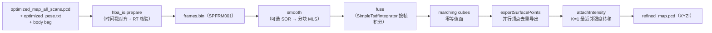

# PCL 模块源码级架构说明

| 项 | 值 |
|---|---|
| 模块名 | PCL |
| 适用版本 | `Spikive-Pcl-Process` git `main` @ `249b488`（v1.0.0） |
| 最后更新 | 2026-09-10 |

## 1. 总体结构

两层结构：

1. Python 编排层（`scripts/process.py`，镜像 ENTRYPOINT）：输入校验、生成帧索引、调用 C++ 引擎、结果校验、报告与记录生成；
2. C++ 引擎层（`pcl_process`）：加载、SOR/MLS 平滑、TSDF 融合、顶点导出、强度转移、统计输出。

C++ 目标结构（`CMakeLists.txt:32-49`）：

| 目标 | 构成 |
|---|---|
| `voxblox_core`（STATIC） | 官方 voxblox 的 6 个源文件 + protoc 生成 `Block.pb.cc`/`Layer.pb.cc`（未修改的 TSDF + marching cubes，不含 ROS/ICP） |
| `process_core` | `src/pipeline.cpp`、`src/surface_export.cpp`、`src/intensity.cpp`（`PCL_NO_PRECOMPILE`、`-Wall -Wextra`） |
| `pcl_process` | `src/main.cpp`，链接 `process_core` |

## 2. 目录与文件职责

| 文件 | 职责 |
|---|---|
| `src/main.cpp` | 入口：`readConfig` → 读地图 PCD → `readFrames` → `smooth` → `fuse` → `attachIntensity` → 写 `refined_map.pcd.partial` → PCL 回读逐点校验 → 写 `native.json`；校验强度转移前后 XYZ 逐点不变（第 37-39 行） |
| `src/pipeline.cpp` | `readConfig`（yaml 解析与范围校验）、`readFrames`（magic `SPFRM001` 帧索引校验）、`smooth`（SOR + 分块 MLS）、`fuse`（TSDF 积分 + marching cubes + 并行导出 + 帧审计 CSV） |
| `src/surface_export.cpp` | `exportSurfacePoints`（哈希分片并行去重，与原生顺序逐位一致）、`availableCpuCount`、`resolveThreads`（0 → `ceil(2/3 × 核数)`） |
| `src/intensity.cpp` | `attachIntensity`（`KdTreeFLANN` K=1、epsilon=0 的 XYZ 最近邻，复制最近有效 MLS 观测的原始 intensity） |
| `include/process/pipeline.hpp` | 类型与声明（`Point = pcl::PointXYZI`、`Config`、`Frame`、`Smoothed`、`FusionStats`、`IntensityStats`） |
| `include/process/surface_export.hpp` | 顶点导出与线程数解析声明 |
| `scripts/process.py` | 三段流程 + 全部 `require` 校验 + `REPORT.md`/`records/` 生成 |
| `scripts/hba_io.py` | `read_poses`（TUM 8 列、纳秒时间戳、单位四元数）、`read_pcd`（严格二进制 FLOAT32 PCD 合同）、`cloud_xyzi`（PointCloud2 解码）、`prepare`（帧时间戳对齐 + RT 数值核对 + `frames.bin`） |
| `scripts/verify_vendor.py` | 上游文件 SHA256 校验 |

## 3. 核心函数与数据结构

### 3.1 配置与帧索引

- `Config`：`threads`、`clean_*`、`mls_*`、`voxel_size`、`truncation`、`sensor_origin_body`；
- `Frame`：`stamp_ns`（纳秒时间戳）、`offset`（点偏移）、`count`、`translation`、`rotation`；
- `readFrames`：二进制帧索引，magic 为 `SPFRM001`；校验帧偏移、覆盖、时间戳单调、四元数单位化；
- `readConfig` 校验：`schema=1`、`fusion.method=tsdf`、`sensor_origin_body_m` 为 3 元序列、各参数范围。

### 3.2 `smooth`（`src/pipeline.cpp`）

1. 可选 `pcl::StatisticalOutlierRemoval`（`mean_k=20`、`stddev_mul=2.0`）；
2. 按 `tile_edge_m` 分块，带完整半径 halo 执行 `pcl::MovingLeastSquares`（多项式阶 2、半径 0.08 m、无上采样、`setCacheMLSResults(true)`、OpenMP）；
3. 用 `getCorrespondingIndices()` 保留点来源；记录位移 RMS/最大值与 `mls_no_output`（PCL 原生无输出的稀疏点）；
4. 输出 `Smoothed`：点云 + `valid` 掩码 + 统计。

### 3.3 `fuse`（`src/pipeline.cpp`）

1. 建 `voxblox::Layer<voxblox::TsdfVoxel>`（体素 0.02 m、block 16）；
2. `SimpleTsdfIntegrator`：`use_const_weight=true`、`voxel_carving_enabled=false`、`allow_clear=false`、`min_ray_length=0`、`max_ray_length=max`；
3. 每帧以 `o_world = R×o_body + t` 为原点、恒等旋转、`p_centred = p_world − o_world` 提交；每个 MLS 点恰好提交一次；
4. `voxblox::MeshIntegrator<TsdfVoxel>::generateMesh(false,false)`（marching cubes 零等值面）；
5. 释放 TSDF 块后 `exportSurfacePoints` 并行导出；帧审计写入 CSV。

### 3.4 `exportSurfacePoints`（`src/surface_export.cpp`）

- `nativeKey`：按原生默认 FLOAT32 `1e-10` 合并尺度构造 `LongIndex`（含 `std::round` 处理负坐标）；
- 流程：收集全部顶点 → 按 key 哈希分片（threads×threads 桶）→ 每分片哈希表去重（保留遍历顺序首个顶点）→ 并行排序恢复顺序 → 输出 `pcl::PointXYZ`；
- 不构造法向与三角形索引（最终 XYZI 不使用）；与未修改上游 `getConnectedMesh()` 的 XYZ 逐位且顺序一致（由 `test_export.cpp` 验证）。

### 3.5 `attachIntensity`（`src/intensity.cpp`）

- `pcl::KdTreeFLANN<Point>`（仅有效 MLS 观测、epsilon=0）对每个表面点做 K=1 精确 XYZ 最近邻；
- 原样复制该观测的 intensity；intensity 不参与距离维度；不截断、不归一化、不平均、无距离门控；
- OpenMP 并行；统计索引/查询耗时、关联距离 RMS/最大值、强度最小/最大值；任一查询失败即抛异常。

### 3.6 Python 编排（`scripts/process.py`）

```text
[1/3] prepare：校验 HBA 地图/位姿/body bag，生成 frames.bin
[2/3] 调用 pcl_process 引擎（PROCESS_ENGINE），核对 native.json 统计与输入一致
[3/3] 校验 refined_map.pcd.partial（点数、4 字段、有限性、输入哈希不变）
      → 生成 records/ 与 REPORT.md → 原子改名发布 refined_map.pcd
失败：写 records/failure.json，不发布最终点云
```

## 4. 数据与坐标合同

取自 `README.md`（"精确的数据与坐标合同"节）：

1. 输入地图必须是 HBA 导出的原始全扫描顺序拼接 XYZI；
2. HBA pose 为 TUM 格式 `T_world_body`，已恢复世界坐标，不再乘首帧原点矩阵；
3. `p_world = R_world_body * p_body + t_world_body`；HBA 地图验证容差 20 微米用于 FLOAT32 数值与文件配对验收；
4. 激光原点单独输入：`o_world = R_world_body * o_body + t_world_body`；不把 body XYZ 再乘一次雷达外参；
5. MLS 点使用世界轴对齐、以该帧激光原点为中心的局部坐标 `p_local = p_world_MLS − o_world`，传给 Voxblox 的变换仅为 `[I, o_world]`；
6. 扫描级固定原点是近似；逐点运动补偿需提供真实采集记录。

边界（README）：MLS 结果共享邻域存在相关性；TSDF 是表面估计的几何融合，权重不等价于校准的独立测量协方差；输出 XYZ 是新估计表面点，不是保持原始点数的无损操作；强度转移是属性转移，不是新量测或辐射标定。

## 5. 处理流水线



## 6. 模块间接口与依赖关系

| 方向 | 对象 | 接口 |
|---|---|---|
| 上游 | PGOBA（`Spikive-BA`） | `optimized_map_all_scans.pcd`、`optimized_pose.txt`（目录输入） |
| 上游 | LIO 数据记录 | 原始 body bag（`/cloud_registered_body`） |
| 输出 | 交付点云 | `refined_map.pcd`（FLOAT32 XYZI） |
| 库依赖 | PCL 1.10.0 / Eigen 3.3.7 / Protobuf 3.6.1 / glog 0.4.0 / yaml-cpp / OpenMP | CMake EXACT 校验 |

C++ 核心不依赖 ROS/GTSAM；ROS1 bag 由 Python `rosbags` 库文件级解码（README）。

## 7. 关键配置项

`config/indoor.yaml` 全部参数含义见 `commandline.md` 第 3 节参数表；固定基线说明（README）：

- `threads: 0` 自动取 2/3 逻辑核；可显式指定用于对照测试；
- 读 bag、校验与写盘仍有串行/I/O 阶段，线程数不等于每时刻 CPU 占用率保证；
- 无 GPU 计算后端：锁定的 Voxblox 上游为 CPU 实现（README 原文说明不使用 Open3D/nvblox/CUDA 融合器）。

## 8. 测试与验收

6 组 CTest（`CMakeLists.txt:50-63`）：

| 测试 | 内容 |
|---|---|
| `geometry_and_provenance` | 分块 MLS 与整图原生 MLS 几何一致性（2e-5 m）、halo 语义、点来源保留、TSDF 平面 RMS < 0.015 m、单/多线程融合一致性 |
| `parallel_export_equivalence` | 1/4/自动线程导出与上游 `getConnectedMesh()` 逐位且顺序一致 |
| `intensity_provenance` | 与独立穷举最近邻一致；XYZ 位模式不变；负值/大于 255 强度不截断 |
| `input_contract` | 纳秒时间戳、非单位四元数拒绝、PCD 精确载荷、大端 PointCloud2 |
| `upstream_unchanged` | vendor 文件 SHA256 校验 |
| `hba_bag_end_to_end` | 合成 HBA + ROS1 bag 端到端：缺失原点不产生输出、重复输出目录拒绝、失败写 `failure.json` |

验收记录见 `VALIDATION.md`（saier2biao XYZI run03：输入 13,321 帧 / 78,926,245 点，输出 61,944,694 点，输出 SHA256 `094eea67…`）。
