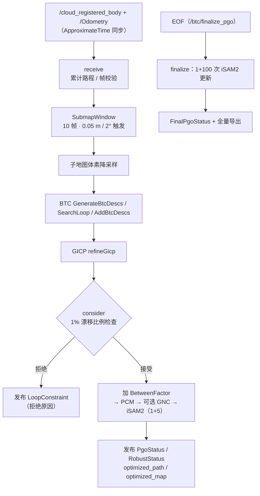
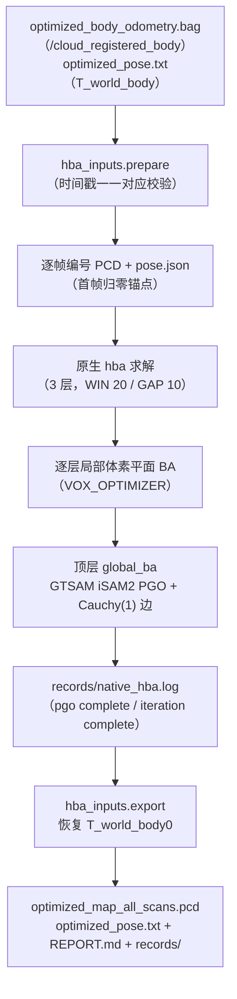

# PGOBA 模块源码级架构说明

| 项 | 值 |
|---|---|
| 模块名 | PGOBA |
| 适用版本 | `Spikive-PGO` git `dev` @ `3560a85`；`Spikive-BA` git `main` @ `35324cb` |
| 最后更新 | 2026-09-10 |

本文件分两部分：第一部分为 PGO 后端（`Spikive-PGO`），第二部分为 BA 后端（`Spikive-BA`）。

# 第一部分：PGO（`spikive_btc`）

## 1. 总体结构

单 ROS 节点 `btc_online_node`（节点名可经 `online.launch` 的 `node_name` 配置）+ 两个离线重放工具。构建目标与源文件（`CMakeLists.txt`）：

| 目标 | 源文件 | 说明 |
|---|---|---|
| `spikive_btc_upstream`（静态库） | `third_party/btc_descriptor/src/btc.cpp` | 官方 BTC，配置期按 `third_party/btc_descriptor.sha256` 校验 |
| `spikive_gicp` | `src/gicp_refine.cpp` + small_gicp 的 `registration_helper.cpp` | GICP 精配准 |
| `spikive_pcm_native`（静态库） | Kimera-RPGO 的 `Logger/GraphUtils/findClique/findCliqueHeu/graphIO/utils` | PCM 最大团求解 |
| `spikive_pgo` | `src/pgo_backend.cpp` + `src/robust_optimizer.cpp` | 位姿图后端，链接 GTSAM、Ceres、Eigen |
| `btc_online_node` | `src/btc_online_node.cpp` | 在线节点 |
| `replay_pgo`、`replay_gicp_refinement` | `src/replay_pgo.cpp`、`src/replay_gicp_refinement.cpp` | 冻结图/候选重放 |

## 2. 目录与文件职责

| 文件 / 目录 | 职责 |
|---|---|
| `src/btc_online_node.cpp` | `OnlineBtc` 类与 main：参数校验、订阅器/发布器/服务、主处理逻辑 |
| `src/pgo_backend.{cpp,hpp}` | `PoseGraph` 与选项/报告结构（`BackendOptions`、`LoopReport`、`LoopState`、`FinalReport`） |
| `src/robust_optimizer.{cpp,hpp}` | `optimizeRobust`：PCM → 可选 GNC → iSAM2 |
| `src/gnc_isam2.hpp` | `GncIsam2Optimizer`：加权子问题 ISAM2 适配 |
| `src/gicp_refine.{cpp,hpp}` | `refineGicp`：small_gicp 注册副本精配准 |
| `src/submap_window.hpp` | `SubmapWindow`：滑动子地图窗口 |
| `src/replay_pgo.cpp` | 读取 SPIKIVE_PGO_V1 图文件，按 `pcm_isam2`/`pcm_gnc_isam2` 两种配置逐回环重放 |
| `src/replay_gicp_refinement.cpp` | 冻结候选精配准重放，校验 ID 一致性后输出新图文件 |
| `config/`、`launch/`、`msg/` | 配置、编排、消息（见第 7、8 节与 `commandline.md`） |
| `scripts/` | 编排与审计（见 `commandline.md` 第 5 节） |
| `third_party/btc_descriptor` | 官方 BTC 完整包（commit `742af157`），仅编译 `src/btc.cpp` |
| `third_party/Kimera-RPGO` | PCM 实现来源（`outlier/Pcm.h`、`max_clique_finder/`），裁剪后构建 `spikive_pcm_native` |
| `third_party/small_gicp` | small_gicp v1.0.1，GICP 注册实现 |
| `docs/` | 输入契约、算法说明、验证记录 |

## 3. 核心类 / 函数 / 数据结构

### 3.1 `OnlineBtc`（`src/btc_online_node.cpp`）

| 成员 | 职责 |
|---|---|
| `receive` | ApproximateTime 同步回调：帧校验、累计路程、子地图窗口累积与触发 |
| `downsample` | 子地图整体体素降采样（可带上限） |
| `recognize` | 生成 BTC 描述子、`SearchLoop` 检索、`AddBtcDescs` 入库、构造图顶点、发布 `PlaceRecognition`、调用 GICP 与 `graph_->consider` |
| `publishConstraint` | 发布 `LoopConstraint` 与 `RefinementDiagnostics` |
| `publishPgo` / `publishMap` / `publishMarkers` / `publishFinal` | 发布优化路径、`PgoStatus`、`RobustStatus`、重建子地图点 `optimized_map`、回环连线、`FinalPgoStatus` |
| `finalize` | 服务 `/btc/finalize_pgo`（Trigger）：EOF 结束全局 PGO |
| `reset` | 服务 `/btc/reset_database`（Trigger）：清空 BTC 数据库与图 |

### 3.2 `SubmapWindow`（`src/submap_window.hpp`）

- 容量 `submap_frames`（10）帧；`push` 满窗后按窗口末帧相对上一触发帧的平移（≥ `keyframe_distance` 0.05 m）或旋转（≥ `keyframe_angle_deg` 2°，用迹比较实现）或强制时间间隔（`max_keyframe_interval`）触发；未触发时弹出最旧帧继续累积。
- `assemble`：以首帧（锚点 `T_W_A`）为参考合并窗口内原始扫描，调用方在合并后只做一次体素降采样。
- `commit` 记录触发位姿与时间戳；`discard`/`reset` 清空窗口。

### 3.3 `PoseGraph`（`src/pgo_backend.{hpp,cpp}`）

| 成员 | 职责 |
|---|---|
| `append(raw, travel)` | 加顶点、先验与相邻里程计 `BetweenFactor` |
| `consider(matched, score, initial, refine)` | 候选回环：1% 漂移门控 → 加回环因子 → PCM/GNC/iSAM2 求解 → 原子提交；返回 `LoopReport` |
| `finalize` | EOF 结束 PGO：同一完整图沿用原始初值、PCM 与权重，1 次提交 + 100 次空 iSAM2 更新；不重跑 BTC/GICP、不新增因子；重复调用复用结果 |
| `invalidateFinalization` / `reset` | 使完成标记失效 / 清空 |
| 访问器 | `poses`、`loops`、`rejected`、`optimizationAttempts/Successes`、`loopStates`、`isam2Solves/Updates`、`gncIterations`、`finalReport` |

噪声模型：`noise()` 生成对角 sigma（`odom_rotation_sigma` 等，见配置表）。

### 3.4 `optimizeRobust`（`src/robust_optimizer.{hpp,cpp}`）

处理顺序（`robust_optimizer.hpp` 注释）：

1. PCM 过滤：`KimeraRPGO::Pcm::removeOutliers`，里程计边与候选回环边分开调用，逐因子回映校验，PCM 排除的因子权重置为 0；
2. 构造 active 图（非回环因子视为可信）；
3. 求解：GNC 开启时经 `GncOptimizer`，关闭时直接 `GncIsam2Optimizer`；每次回环重建完整图，不跨回环保留增量树（README 与 `gnc_isam2.hpp` 注释）。

`RobustResult`：估计值、权重向量、`pcm_selected`、iSAM2/GNC 计数、前后误差。

### 3.5 `GncIsam2Optimizer`（`src/gnc_isam2.hpp`）

- ISAM2 参数：`relinearizeThreshold=0.01`、`relinearizeSkip=1`；
- 每个加权子问题：1 次带图 update + `extra_updates`（5）次空 update；
- `GncIsam2Params` 适配 GTSAM `GncParams::OptimizerType` 契约。

### 3.6 `refineGicp`（`src/gicp_refine.{hpp,cpp}`）

- small_gicp `preprocess_points`（0.25 m、10 邻域）+ `RegistrationSetting(GICP)`；
- 对独立注册副本执行 `align`，返回完整 `T_target_source`；仅诊断性计算最近邻 RMSE，无额外门控；
- 原始 BTC 子地图不被修改（`btc_pgo.yaml` 注释）。

## 4. 处理流水线与数据流



## 5. 1% 漂移比例检查的精确定义

取自 `Spikive-PGO/README.md`：

```text
T_pred  = inverse(T_W_M_before_PGO) * T_W_C_before_PGO
drift   = norm(translation(T_pred) - translation(T_M_C_GICP))
travel  = cumulative_raw_travel[C] - cumulative_raw_travel[M]
accept  = drift / travel < 0.01
```

- 预测位姿来自本次优化前的当前图估计；路程来自原始里程计在 M→C 区间的累计路程；
- 分母不是起点至今总里程、不是上次回环后里程、不是两端直线距离；
- 使用 GICP 最终 RT；检查发生在 PCM/PGO 之前；恰好等于 1% 也拒绝。

## 6. 输入契约与坐标约定

取自 `Spikive-PGO/docs/frame_contract.md`：

- 输入只用 `/cloud_registered_body`（frame `body`，已去畸变、已过 LiDAR→IMU 外参）与 `/Odometry`（`T_W_B(t)`，frame `camera_init`→`body`）；
- 列向量约定 `p_W = R_W_B * p_B + t_W_B`；ROS 消息四元数为 xyzw，Eigen 构造参数为 wxyz，不能按位置互拷；
- 子地图锚定首帧：`p_A = inverse(T_W_A) * T_W_B(t) * p_B`；
- BTC `SearchLoop` 返回的 `T_M_C` 与 GICP 输出均为"当前子地图 C → 匹配子地图 M"，不是世界坐标位姿；GTSAM 使用 `BetweenFactor(M, C, T_M_C)`，同向里程计相对位姿为 `inverse(T_W_M) * T_W_C`；
- 回环 ICP 由 BTC 结果初始化，不用原始里程计初始化；不能通过改输入外参修复候选错配；
- 导出修正：`C_k = T_W_A_optimized * inverse(T_W_A_raw)`；
- 审计脚本：`audit_live_fastlio_frames.py`（验证 `T_W_B * cloud_body == cloud_world`）、`audit_btc_loop_rt.py`（保存每条回环的原始相对位姿、BTC 初值、ICP 结果、PGO 前预测矩阵）。

## 7. 关键配置项（`config/btc_pgo.yaml`）

| 分组 | 参数 | 默认值 | 含义 |
|---|---|---|---|
| 顶层 | `cloud_topic` / `odom_topic` / `world_frame` / `cloud_frame` | `/cloud_registered_body` / `/Odometry` / `camera_init` / `body` | 输入契约 |
| 顶层 | `sync_queue_size` / `sync_tolerance` | 100 / 0.005 | 同步队列与容差 |
| 顶层 | `submap_frames` / `keyframe_distance` / `keyframe_angle_deg` / `max_keyframe_interval` | 10 / 0.05 / 2.0 / 5.0 | 子地图窗口参数 |
| 顶层 | `downsample_leaf` / `min_points` / `max_submap_points` / `max_keyframes` / `debug` | 0.1 / 100 / 100000 / 3000 / false | 降采样与上限 |
| `custom` | `min_points_enabled` 等 4 项 | 均 false | 可选自定义门控，默认关闭 |
| `gicp` | `downsampling_resolution` / `max_correspondence_distance` / `max_iterations` / `rotation_eps` / `translation_eps` | 0.25 / 1.0 / 20 / 0.001745…（0.1°） / 0.001 | small_gicp 原生注册参数 |
| `pgo` | `enabled` / `final_global.enabled` | true / true | 在线 PGO / EOF 结束 PGO 开关 |
| `pgo` | `odom_rotation_sigma` / `odom_translation_sigma` / `loop_rotation_sigma` / `loop_translation_sigma` / `prior_sigma` | 0.01 / 0.05 / 0.01 / 0.01 / 0.001 | 噪声 sigma（弧度/米） |
| `pgo` | `extra_score_enabled` / `score_threshold` / `drift_ratio_enabled` / `drift_ratio` / `rotation_consistency_enabled` / `max_rotation_deg` / `reject_error_increase` / `error_increase_tolerance` / `min_travel_enabled` / `min_travel_m` | 见文件 | 门控；仅 `drift_ratio_enabled=true`（0.01）生效 |
| `pgo.gnc` | `enabled` / `max_iterations` / `mu_step` / `relative_cost_tol` / `weights_tol` | false / 100 / 1.4 / 1.0e-5 / 0.0 | GNC-TLS，默认关闭；`weights_tol=0` 为保留的收敛实验值 |
| `pgo.pcm` | `enabled` / `odom_threshold` / `loop_threshold` | true / 10.0 / 5.0 | PCM（Mahalanobis 范数，非米/弧度）；负数禁用对应原生检查 |
| `visualization` | `map_max_points` / `map_period` | 200000 / 3.0 | 地图发布上限与周期 |

`config/robust_profiles/pcm.yaml`、`pcm_gnc.yaml` 为 PCM 与 PCM+GNC 的配置片段（经 `online.launch` 的 `robust_config` 参数叠加加载）。

## 8. 消息定义（`msg/`）

| 消息 | 字段要点 |
|---|---|
| `PlaceRecognition` | 会话、匹配对、分数、锚点姿态、相对变换 |
| `LoopConstraint` | 接受/拒绝、拒绝原因、1% 漂移量、图误差 |
| `PgoStatus` | 关键帧与回环计数、修正 RMS/max |
| `RobustStatus` | PCM 选择与权重、GNC/iSAM2 累计计数 |
| `RefinementDiagnostics` | GICP 收敛、对应数、RMSE、加权误差、Hessian 诊断 |
| `FinalPgoStatus` | EOF 结束 PGO 报告与前后路径 |

## 9. 第三方组件集成方式

- BTC（`btc_descriptor`）：官方完整树 vendor，只编译 `src/btc.cpp` 为静态库；构建前逐字节 SHA256 校验（`third_party/btc_descriptor.sha256`）；`scripts/check_upstream_btc.py` 提供独立核验。
- Kimera-RPGO：vendor 裁剪，仅保留 PCM 与最大团依赖，构建 `spikive_pcm_native`；`test/check_native_clique.cpp` 验证精确最大团与上游启发式的一致性。
- small_gicp：v1.0.1 源码接入 `spikive_gicp` 目标。

# 第二部分：BA（`spikive_ba`）

## 10. 总体结构

- ROS 侧：`launch/global_ba.launch` → `scripts/hba_run.py`（节点 `/global_ba_hba`）→ 生成原生输入、执行原生求解二进制、导出结果。
- 原生求解器：`third_party/HBA`（官方 HBA，commit `a0cdd47`），构建时复制到构建目录并应用 2 个补丁后编译为 `hba` 与 `visualize_map`。
- 包根无 `src/`、`include/`；C++ 代码位于 `integration/hba/`（集成与测试）与 `third_party/HBA/`（官方源码）。

## 11. 目录与文件职责

| 文件 / 目录 | 职责 |
|---|---|
| `integration/hba/CMakeLists.txt` | SHA256 校验 → 复制 → 打补丁 → 编译 → 安装 → CTest 注册 |
| `integration/hba/cauchy.patch` | `hba.hpp` 两处修改：include `top_edge_noise.hpp`；顶层 BA 边 `odometryNoise` 由 `Diagonal::Variances(Vector6)` 改为 `spikive_hba::topEdgeNoise(Vector6)` |
| `integration/hba/indoor_parameters.patch` | `hba.hpp`：`max_iter` 10→30、`downsample_size` 0.1→0.05、`voxel_size` 4.0→0.5、`eigen_ratio` 0.1→0.05、`reject_ratio` 0.05→0.1；`ba.hpp`：`WIN_SIZE` 10→20、`GAP` 5→10 |
| `integration/hba/top_edge_noise.hpp` | `spikive_hba::topEdgeNoise(variances)`：`Robust(Cauchy(1.0), Diagonal::Variances)` |
| `integration/hba/implementation.json.in` | 编译期填充各 SHA256 的实现声明，安装为 `hba-implementation.json` |
| `integration/hba/test_cauchy.cpp` | CTest `hba_cauchy`：iSAM2 小图验证 Cauchy(1) 白化降权与图求解 |
| `integration/hba/test_window.cpp` | CTest `hba_window`：构造 HBA 对象验证 20/10 分层窗口、Hessian 配对、PGO 索引与首帧锚点 RT |
| `scripts/hba_run.py` | ROS 编排节点：`main`、`verify_native`（ldd 校验 GTSAM 4.1.1）、`rviz_config`、`spawn`（以私有参数启动原生 `hba`）、`viewer`（`visualize_map`） |
| `scripts/hba_inputs.py` | `prepare`（bag+pose.txt → 原生编号 PCD + `pose.json` + manifest）、`export`（原生结果 → `optimized_map_all_scans.pcd` + `optimized_pose.txt`） |
| `scripts/pose_io.py` | TUM 位姿与 PointCloud2 解码、SHA256、校验 |
| `provenance/migration.json` | 迁移来源（Spikive-PGO 工作树 base `37cad9ae`）、17 个迁移文件与函数的源码 SHA256 |
| `test/` | `audit_hba_result.py`（独立逐点核验）、`prepare_smoke.py`（2200 帧冒烟夹具）、`test_hba_inputs.py`（9 项）、`test_package.py`（5 项） |

## 12. 官方 HBA 核心类 / 函数（`third_party/HBA/`）

| 文件 | 核心内容 |
|---|---|
| `include/hba.hpp` | `class LAYER`、`class HBA`：分层管理、`update_next_layer_state`（逐层下采样位姿）、`pose_graph_optimization`（顶层 GTSAM iSAM2 PGO，Cauchy 补丁点，约 239-242 行） |
| `include/ba.hpp` | `VOX_HESS`、`OCTO_TREE_NODE`、`OCTO_TREE_ROOT`、`VOX_OPTIMIZER`：体素八叉树平面 BA（`damping_iter` LM 迭代、`remove_outlier` 残差体素剔除、`acc_evaluate2`）；宏 `WIN_SIZE`/`GAP` 与 `layer_limit` |
| `include/mypcl.hpp` | `namespace mypcl`、`struct pose`；`loadPCD`/`savdPCD`、`read_pose`、`transform_pointcloud`、`append_cloud`、`compute_inlier_ratio`、`write_pose` |
| `include/tools.hpp` | `VOXEL_LOC`、`IMUST`、`M_POINT`、`VOX_FACTOR`；`downsample_voxel`、`pl_transform`、`esti_plane`、`sigmoid_w`、`matrixAbsSum` |
| `source/hba.cpp` | `main`（读取 `data_path`/`total_layer_num`/`thread_num`）；`cut_voxel`、`parallel_comp`、`parallel_tail`、`global_ba`、`distribute_thread`：逐层循环后执行顶层 BA |
| `source/visualize.cpp` | `main`：降采样点云并发布 `/cloud_map`、`/poseArrayTopic`、`/trajectory_marker`、`/pose_number` |
| `source/calculate_MME.cpp` | `main`、`computeEntropy`、`PC2Entropy`：地图平均熵评估 |

## 13. BA 处理流水线



## 14. 关键配置项

运行参数固化在 `docker/hba.lock.yaml`（不通过命令行修改）：

| 分组 | 参数 | 值 |
|---|---|---|
| `upstream` | repository / commit / vendor_patches | 官方 HBA `a0cdd47` + 2 个补丁 |
| `gtsam` | version / commit / tbb | 4.1.1 / `69a3a75...` / on |
| 单值 | `eigen` / `pcl` / `ceres` | 3.3.7 / 1.10.0 / 2.1.0 |
| `pgo_robust` | kernel / scale / reweight / isam2_updates | Cauchy / 1.0 / Block / 2 |
| `native_parameters` | `total_layer_num` / `thread_num` / `pcd_name_fill_num` / `window_size` / `gap` / `downsample_size` / `voxel_size` / `eigen_ratio` / `global_eigen_ratio` / `reject_ratio` / `max_iter` / `layer_limit` | 3 / 16 / 0 / 20 / 10 / 0.05 / 0.5 / 0.05 / 0.1 / 0.1 / 30 / 2 |
| `passes` | — | 1（完整 HBA 次数） |
| `runtime` | `memory_gib` / `additional_swap_gib` | 52 / 0 |

## 15. 模块间接口与依赖关系

| 方向 | 对象 | 接口 |
|---|---|---|
| PGO 上游 | SLAM 模块（`lsdc_slam`） | `/cloud_registered_body`、`/Odometry` |
| PGO 下游 | BA 模块 | `optimized_body_odometry.bag`、`optimized_pose.txt` |
| BA 下游 | PCL 模块（`Spikive-Pcl-Process`） | `optimized_map_all_scans.pcd`、`optimized_pose.txt` |
| 库依赖（PGO） | Eigen 3.3.7 / Ceres 2.1.0 / GTSAM 4.2.0 / PCL / OpenCV / TBB | CMake EXACT 校验 |
| 库依赖（BA） | Eigen 3.3.7 / PCL 1.10.0 / GTSAM 4.1.1 / Ceres 2.1.0 | CMake EXACT 校验 |

两仓库间无源码依赖：`spikive_ba` 不依赖 `spikive_btc` 的源码或消息（`Spikive-BA/README.md` 原文）。
