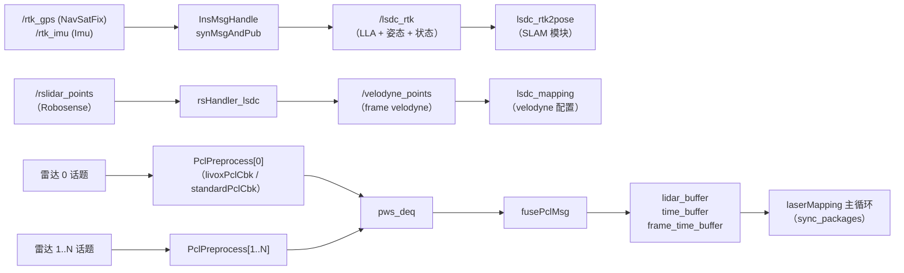

# preprocess 模块源码级架构说明

| 项 | 值 |
|---|---|
| 模块名 | preprocess |
| 适用版本 | 随 `Spikive-SLAM` git `main` @ `c86c818` |
| 最后更新 | 2026-09-10 |

## 1. 总体结构

本模块为 `lsdc_slam` 包内的预处理子系统，由三个相互独立的代码块组成：

1. INS GPS/IMU 时间同步（节点 `ins_preprocess`）；
2. Robosense 点云到 Velodyne 兼容格式的转换（节点 `rs_converter`）；
3. 单雷达帧解析与多雷达融合（编入 `lsdc_mapping` 进程，无独立节点）。

三块之间无直接调用关系；块 3 与 SLAM 模块 LIO 主循环的接口见第 4 节。

## 2. 核心类 / 函数 / 数据结构

### 2.1 `InsMsgHandle`（`src/preprocess/ins_preprocess.cpp:48`）

| 成员 | 职责 |
|---|---|
| `gpsStatusOk` | GPS 可用性判定：`status.status` 为 48/49/50 时返回 true（第 58-61 行） |
| `pubRtkMsg` | 组装 `/lsdc_rtk`：`position.x/y/z` 存纬度/经度/高度，`orientation` 存 INS 姿态，`child_frame_id` 为 `OK` 或 `-`（第 62-76 行） |
| `synMsgAndPub` | 双队列时间同步：以 ±0.05 s 为窗口丢弃过期消息，在窗口内取与 GPS 时间戳最接近的 IMU 消息配对发布（第 79-112 行） |
| `imuCallback` / `gpsCallback` | 入队并触发同步；`init_time` 记录首条消息时间 |

消息语义（非标准 `Odometry` 用法，与仓库 `docs/coordinate_frames.md` 一致）：

| 字段 | 语义 |
|---|---|
| `pose.pose.position.x/y/z` | 纬度 / 经度 / 高度 |
| `pose.pose.orientation` | INS 姿态四元数 |
| `child_frame_id` | `"OK"` 可用；`"-"` 不可用（RTK 状态） |

### 2.2 `rsHandler_lsdc`（`src/preprocess/rs_to_velodyne.cpp:61`）

处理步骤：

1. 解码 Robosense 点云（`RsPointXYZIRT`，定义于 `pcl_struct.hpp:9`）；
2. `has_nan` 过滤 NaN 点（第 37-46 行）；
3. 外参变换 `pt = rs_to_avia_R * pt + rs_to_avia_T`（第 76 行）；若 `rs_to_avia_E` 非零，先用 Z-Y-X 欧拉角生成旋转矩阵覆盖（第 125-130 行）；
4. ring 重映射：16 线用 `RING_ID_MAP_16`（按 `point_id / width` 索引），128 线用 `RING_ID_MAP_RUBY`（按 `point_id % height` 索引）（第 24-32、86-90 行）；
5. 时间重映射：`time = timestamp[i] - timestamp[0]`（相对首点，第 93 行）；
6. 发布 `/velodyne_points`，`frame_id = "velodyne"`（第 49-59 行）。

点结构（`pcl_struct.hpp`）：

| 结构 | 字段 |
|---|---|
| `RsPointXYZIRT` | x/y/z、`intensity`(uint8)、`ring`(uint16)、`timestamp`(double) |
| `VelodynePointXYZIRT` | x/y/z、`intensity`、`ring`(uint16)、`time`(float) |
| `VelodynePointXYZIR` | x/y/z、`intensity`、`ring`(uint16) |

### 2.3 `Preprocess`（`src/LIO/preprocess.h:104`）

| 成员 | 职责 |
|---|---|
| `process(CustomMsg)` | Livox 入口，调用 `avia_handler`（`preprocess.cpp:52-56`） |
| `process(PointCloud2)` | 标准点云入口：按 `time_unit` 换算时间尺度，按 `lidar_type` 分发到 `oust64_handler`/`velodyne_handler`/`s10u_handler`（第 58-96 行） |
| `avia_handler` | Livox CustomMsg 解析、盲区过滤、抽稀、特征提取（第 119 行起） |
| `oust64_handler` | Ouster 点云解析（第 212 行起） |
| `velodyne_handler` | Velodyne 点云解析（第 305 行起） |
| `s10u_handler` | S10U 解析：FOV 裁剪（`s10u_point_in_fov`）、盲区过滤、时间戳校验（偏移在 [-1, 200000] µs 内，早于 timebase 或偏移过大者丢弃）、曲率字段存相对毫秒偏移供去畸变（第 471 行起） |
| `s10u_point_in_fov` | 以 `atan2` 计算垂直/水平角，与 `vertical_fov_degree`、`horizontal_fov_degree` 的一半比较（第 98-117 行） |
| `give_feature` | 特征分类：`plane_judge`（平面判定）、`small_plane`（小平面）、`edge_jump_judge`（边沿跳变），结果写入 `orgtype.ftype`（第 675 行起） |
| `pub_func` | 按需发布全量/平面/角点点云（第 930 行起） |

数据结构与枚举（`preprocess.h`）：

- `LID_TYPE`：`AVIA=1`、`VELO16=2`、`OUST64=3`、`S10U=4`；
- `TIME_UNIT`：`SEC=0`、`MS=1`、`US=2`、`NS=3`；
- `Feature`：`Nor`、`Poss_Plane`、`Real_Plane`、`Edge_Jump`、`Edge_Plane`、`Wire`、`ZeroPoint`；
- `orgtype`：单点特征分类信息（`range`、`dista`、`angle[2]`、`intersect`、`edj[2]`、`ftype`）；
- 点结构：`velodyne_ros::Point`、`ouster_ros::Point`、`lx_ros::Point`（S10U，含 `timestamp`(double)、`row_pos`、`col_pos`）；
- `PointType` = `pcl::PointXYZINormal`（curvature 字段复用为相对时间偏移）。

### 2.4 `pcl_pre` 命名空间（`src/LIO/pcl_preprocess.hpp`）

| 类 / 函数 | 职责 |
|---|---|
| `LidarFrameTimeInfo` | 帧时间信息：`raw_header_time`、`point_min/max_offset_ms`、`point_min_time`、`point_end_time` 等 |
| `PclWithStamp` | 帧点云 + 起止时间戳 + 时间信息包装 |
| `PclPreprocess` | 单雷达预处理实例：构造时按 `{类型}_` 前缀读取参数（第 234-251 行）；AVIA 订阅 `livoxPclCbk`，其它订阅 `standardPclCbk` |
| `PclPreprocess::transPclToMainLidar` | 用 `{前缀}mapping/extrinsic_T/R` 把该雷达点云变换到主雷达系（第 94-103 行） |
| `PclPreprocess::buildFrameTimeInfo` | 从点 curvature 字段统计帧内最小/最大时间偏移（第 105-133 行） |
| `PclPreprocess::updateLidarImuTimeDiff` | `common/time_sync_en` 为 true 时，估计并固定 LiDAR-IMU 时间差（第 135-144 行） |
| `livoxPclCbk` / `standardPclCbk` | 时间倒退检测（清空队列）、帧预处理、外参变换、压入 `pws_deq`、触发 `fusePclMsg` |
| `fusePclMsg` | 多雷达融合：以雷达 0 的帧时间窗口为基准，把其它雷达在该窗口内的点并入融合帧，写入全局 `lidar_buffer`、`time_buffer`、`frame_time_buffer`（第 266-312 行） |
| `initPclPrepreocess` | 解析 `-` 分隔的雷达类型串，创建多个 `PclPreprocess` 实例（第 323-330 行） |

共享缓冲区（`extern`，由 `laserMapping.cpp` 定义）：`lidar_buffer`、`time_buffer`、`frame_time_buffer`，以及条件变量 `sig_buffer`、互斥锁 `mtx_buffer`。LIO 主循环经 `sync_packages` 从这些缓冲区取帧。

## 3. 调用链与数据流

## 4. 模块间接口与依赖关系

| 方向 | 对象 | 接口 |
|---|---|---|
| 上游 | GPS/INS 设备驱动 | `/rtk_gps`、`/rtk_imu` |
| 上游 | Robosense 驱动 | `/rslidar_points` |
| 上游 | `livox_ros_driver` | `CustomMsg` 话题（`{前缀}common/lid_topic`） |
| 下游 | `lsdc_rtk2pose`（SLAM 模块） | `/lsdc_rtk` |
| 下游 | `lsdc_mapping`（SLAM 模块） | `/velodyne_points`；进程内共享缓冲区 `lidar_buffer` 等 |

依赖库：GeographicLib（`ins_preprocess` 链接）、PCL、Eigen、OpenCV（`rs_velodyne` 链接变量引用）。

## 5. 关键配置项

| 配置组 | 参数 | 含义 |
|---|---|---|
| `ins` | `gps_topic`、`imu_topic` | INS 节点输入话题 |
| `mapping` | `rs_to_avia_T`、`rs_to_avia_E`、`rs_to_avia_R` | Robosense 相对主雷达外参（交付配置未定义，默认恒等） |
| `{前缀}preprocess` | `lidar_type`、`scan_line`、`blind`、`feature_extract_enable`、`point_filter_num`、`timestamp_unit`、`scan_rate`、`fov_crop_enable`、`vertical_fov_degree`、`horizontal_fov_degree` | 单雷达帧预处理参数（`pcl_preprocess.hpp:234-246`） |
| `{前缀}common` | `lid_topic` | 该雷达话题 |
| `{前缀}mapping` | `extrinsic_T`、`extrinsic_R` | 该雷达相对主雷达外参 |
| `common` | `time_sync_en` | LiDAR-IMU 时间差自估计开关（`pcl_preprocess.hpp:136`） |

各型号取值见 SLAM 模块 `architecture.md` 第 6.2 节表。

## 6. 待确认项（本文件范围）

1. `config/velodyne.yaml` 的 `ins/ins_gps_topic`、`ins/ins_imu_topic` 命名与本节点读取参数不一致。
2. `mapping/rs_to_avia_*` 未在交付配置中定义，默认恒等外参是否与现场标定一致。

以上均汇总至 `docs/zh/appendix/pending-items.md`。
