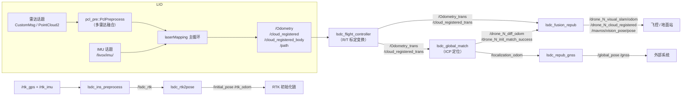

# SLAM 模块源码级架构说明

| 项 | 值 |
|---|---|
| 模块名 | SLAM |
| 适用版本 | `Spikive-SLAM` git `main` @ `c86c818`（`lsdc_slam` 0.0.0） |
| 最后更新 | 2026-09-10 |

## 1. 总体结构

本包为单个 catkin 包，构建 9 个可执行文件，对应 9 个 ROS 节点入口。可执行文件与源文件的对应关系由 `CMakeLists.txt:100-135` 定义：

| 可执行文件 | 源文件 | 链接库（附加） |
|---|---|---|
| `rs_velodyne` | `src/preprocess/rs_to_velodyne.cpp` | PCL、OpenCV（变量引用，见 docker-build.md 第 8 节） |
| `lsdc_mapping` | `src/LIO/laserMapping.cpp`、`include/ikd-Tree/ikd_Tree.cpp`、`src/LIO/preprocess.cpp` | PCL、Python |
| `lsdc_ins_preprocess` | `src/preprocess/ins_preprocess.cpp` | GeographicLib |
| `lsdc_flight_controller` | `src/localization/flight_controller.cpp` | PCL、Ceres |
| `lsdc_repub_gnss` | `src/RTK/repub_gnss.cpp` | GeographicLib |
| `lsdc_rtk2pose` | `src/RTK/rtk2pose.cpp` | GeographicLib、Ceres |
| `lsdc_global_match` | `src/localization/global_match.cpp` | PCL、Ceres |
| `lsdc_fusion_repub` | `src/localization/fusion_repub.cpp` | PCL、Ceres |
| `lsdc_save_result` | `src/LIO/save_result.cpp` | 仅 catkin |

系统分五层（本仓库 `docs/architecture.md`）：传感器预处理、LIO 建图、RTK 初始化、Motion Control 标定适配、Localization / world 收口。

## 2. 目录与文件职责

| 文件 / 目录 | 职责 |
|---|---|
| `src/LIO/laserMapping.cpp` | `lsdc_mapping` 节点 main（节点名 `laserMapping`）；LIO 主循环 |
| `src/LIO/IMU_Processing.hpp` | `ImuProcess`：IMU 初始化、前向传播、点云去畸变 |
| `src/LIO/preprocess.h` / `.cpp` | `Preprocess`：单雷达帧解析与特征提取（细节见 preprocess 模块文档） |
| `src/LIO/pcl_preprocess.hpp` | `pcl_pre` 命名空间：多雷达配置读取、外参变换、多雷达帧融合（细节见 preprocess 模块文档） |
| `src/LIO/save_result.cpp` | `lsdc_save_result` 节点：bag 录制器；旧版 ENU 化逻辑保留在注释中的 `legacyMain` |
| `src/localization/flight_controller.cpp` | `lsdc_flight_controller` 节点：标定外参变换，输出 `/Odometry_trans`、`/cloud_registered_trans` |
| `src/localization/fusion_repub.cpp` | `lsdc_fusion_repub` 节点：按定位状态输出稳定话题与 MAVROS 话题 |
| `src/localization/global_match.cpp` | `lsdc_global_match` 节点：WayPoint 地图 ICP 定位 |
| `src/preprocess/` | `ins_preprocess.cpp`、`rs_to_velodyne.cpp`、`pcl_struct.hpp`（详见 preprocess 模块文档） |
| `src/RTK/rtk2pose.cpp` | RTK LLA 转本地位姿与初始位姿 |
| `src/RTK/repub_gnss.cpp` | 本地定位位姿反算经纬度重发布 |
| `include/common_lib.h` | 类型别名（`V3D`、`PointType` 等）、宏（`G_m_s2`、`DEBUG_FILE_DIR` 等）、`StatesGroup`、`MeasureGroup` 结构体 |
| `include/use-ikfom.hpp` | `state_ikfom` 流形（23 维）、`input_ikfom`、状态转移 `get_f`/`df_dx`/`df_dw` |
| `include/so3_math.h`、`Exp_mat.h` | SO3 数学工具 |
| `include/lsdc_geo.hpp` | `LsdcGeographicLib`：GeographicLib 封装，LLA 与本地坐标互转 |
| `include/lsdc_math.hpp`、`lsdc_tools.hpp`、`odom_struct.hpp` | SE3 工具、体素降采样、odom 结构包装 |
| `include/ikd-Tree/` | hku-mars ikd-Tree 增量 KD 树（`KD_TREE`），源文件直接编入 `lsdc_mapping` |
| `include/IKFoM_toolkit/` | hku-mars IKFoM 流形卡尔曼滤波工具箱（`esekfom::esekf`、`dyn_share_datastruct`） |
| `include/Commons/` | 地理工具头文件集（`LocalGeographicCS.hpp`、`WGS84toCartesian.hpp`、`convert_coordinates.hpp` 等） |
| `include/matplotlibcpp.h` | 第三方单头文件库（C++ 内嵌 Python 绘图） |
| `msg/` | `Pose6D.msg`（预积分雷达状态）、`bywire_chassis_state.msg`（底盘状态） |
| `config/` | 参数文件（见第 6 节） |
| `launch/` | 场景编排（见 `commandline.md`） |
| `Lsdc_Repub/` | 运行期位姿记录目录；`rtk2pose.cpp` 与 `repub_gnss.cpp` 分别读写其中的 `last_pose.txt`、`pose_init.txt` |

## 3. 核心类 / 函数 / 数据结构

### 3.1 `lsdc_mapping`（`src/LIO/laserMapping.cpp`）

- 参数读取（`main`，第 845-878 行）：`publish/*`、`common/*`、`mapping/*`、`pcd_save/*`、`runtime_pos_log_enable`；第 882 行读取 `argv[1]` 作为雷达类型串（多雷达以 `-` 分隔），传给 `pcl_pre::initPclPrepreocess`。
- 数据结构：
  - `state_ikfom`（`use-ikfom.hpp`）：23 维状态（位置、旋转、IMU-LiDAR 外参、速度、陀螺/加速度偏置、重力）；
  - `KD_TREE`（ikd-Tree）：增量 KD 树地图；
  - `PointType`（`preprocess.h`）：`PointXYZINormal`（曲率字段复用为时间偏移）。
- 主循环（`main` 内 while 循环）：
  1. `sync_packages`：IMU 与点云时间对齐（含 S10U 帧时间校验）；
  2. `ImuProcess::Process`：前向传播 + 后向去畸变（`IMU_Processing.hpp` 的 `IMU_init`、`UndistortPcl`）；
  3. 体素降采样；
  4. `lasermap_fov_segment`：局部地图立方体滑动与 ikd-Tree 删除；
  5. `h_share_model`：最近面搜索、平面残差与雅可比；
  6. `kf.update_iterated_dyn_share_modified`：迭代卡尔曼更新（`esekfom`）；
  7. `map_incremental`：ikd-Tree 增量建图；
  8. 发布 `/Odometry`（`camera_init`→`body`）、`/cloud_registered`、`/cloud_registered_body`、`/path`。
- 与 `Preprocess`/`PclPreprocess` 的接口：点云回调由 `pcl_pre` 命名空间写入共享 `lidar_buffer`，主循环取帧（详见 preprocess 模块文档）。

### 3.2 `lsdc_flight_controller`（`src/localization/flight_controller.cpp`）

- `validateExtrinsic`：校验全局参数 `R`、`T` 的尺寸、有限值、正交性、`det(R)`；不合法时节点退出。
- odom 变换：SE3 共轭 `trans_odom = D * lio_odom * D^-1`，平移再叠加私有参数 `init_x/y/z` 平移偏置；点云变换：`point_world = R * point + T + init_translation`。
- 输出：`/Odometry_trans`、`/cloud_registered_trans`（frame `world`）。

### 3.3 `lsdc_fusion_repub`（`src/localization/fusion_repub.cpp`）

- 订阅 `/Odometry_trans`、`/cloud_registered_trans`、`/drone_{id}_diff_odom`、`/drone_{id}_init_match_success`。
- 输出逻辑（与 `docs/coordinate_frames.md` 一致）：

```text
若 init_match_success 为 true：
    stable_odom  = diff_odom * calibrated_odom
    stable_cloud = diff_odom * calibrated_cloud
否则：
    stable_odom  = calibrated_odom
    stable_cloud = calibrated_cloud
```

- 发布：`/drone_{id}_visual_slam/odom`、`/drone_{id}_cloud_registered`、`/localization_odom`、`/localization_cloud_registered`、`/mavros/vision_pose/pose`、`/mavros/companion_process/status`（component=197）。

### 3.4 `lsdc_global_match`（`src/localization/global_match.cpp`）

- 参数：`localization/*`（`match_freq`、`filter_size_map/src`、`fov_far/ang`、`max_iteration`、`fitness_threshold`、`success_confirm_count`、`match_timeout_sec`、`status_publish_period_sec`、`continuous_match`、`initial_pose_is_world`、`display_matching_time`、`debug_do_not_match`）。
- 状态机：`idle → map_loaded → waiting_initialpose → matching → localized / failed`（各状态含义见 `commandline.md` 第 6 节）。
- 校正量换算：`T_diff_guess = T_initial_world * inverse(T_calibrated_current)`。
- `runIcp`：三级分辨率 ICP（scale 10/5/1）；连续成功次数达到 `success_confirm_count` 后发布 `/drone_{id}_diff_odom`、`/drone_{id}_init_match_success`（latched）、`/drone_{id}_localization_match_status`（JSON）。
- 另发布 `/map`、`/submap`（latched 地图）、`/fov_sphere_marker`（可视化）。

### 3.5 `lsdc_rtk2pose`（`src/RTK/rtk2pose.cpp`）

- 订阅 `/lsdc_rtk`，用 `lsdc::LsdcGeographicLib`（`include/lsdc_geo.hpp`）做 LLA→本地 odom 转换；RTK 无效（`child_frame_id=="ERROR"`）时回退读取 `Lsdc_Repub/last_pose.txt`。
- 周期 0.5 s 发布 `/initial_pose`（`PoseWithCovarianceStamped`，frame `map`）、`/rtk_odom`、`/rtk_path`；将 Origin/Init/Delta Pose 写入 `pose_init.txt`。
- 参数：`rtk/use_map_origin`、`rtk/frame_id`（默认 `camera_init`）、`input_path`（默认 `ROOT_DIR + "Lsdc_Repub/"`）。

### 3.6 `lsdc_repub_gnss`（`src/RTK/repub_gnss.cpp`）

- 订阅 `/localization_odom`、`/Odometry`、`/ins_lla`、`/bywire_chassis`、`/init_match_success`。
- Localization 成功后用 `LsdcGeographicLib::getRtkFromOdom` 把本地位姿反算为经纬度，发布 `/global_pose`（`PoseStamped`，position 存 LLA）与 `/gnss`（`NavSatFix`）；经纬度与四元数写入 `Lsdc_Repub/last_pose.txt`。
- `judgeState`：预留车速一致性校验，当前恒返回 true。

### 3.7 `lsdc_ins_preprocess`、`rs_velodyne`、`Preprocess`、`PclPreprocess`

见 preprocess 模块文档 `docs/zh/preprocess/architecture.md`。

### 3.8 `lsdc_save_result`（`src/LIO/save_result.cpp`）

- 当前 `main` 为 bag 录制器：私有参数 `drone_id`、`visual_odom_topic`、`save_dir`；订阅 `/drone_{id}_bag_record_start`、`_stop`，录制 `/cloud_registered_body`、`/Odometry_trans`、视觉里程计、IMU，写 `.active.bag` 后改名为 `.bag`；发布 `/drone_{id}_bag_record_status`。
- `legacyMain`（ENU 化 `/Odometry_enu`、`/rtk_odom_enu`、`/pcl_map`、`/initial_pose` 订阅）整体保留在注释中，当前不编译。

## 4. 调用链与数据流



RTK 链路与 LIO 链路相互独立；`lsdc_repub_gnss` 的输入来自 `lsdc_global_match` 状态与 `/Odometry`。

## 5. 模块间接口与依赖关系

| 方向 | 对象 | 接口 |
|---|---|---|
| 上游 | `livox_ros_driver` | 雷达话题（`{前缀}common/lid_topic`）、IMU 话题（`common/imu_topic`） |
| 上游 | Robosense 驱动 | `/rslidar_points`（经 `rs_velodyne` 转换后进入 velodyne 链路） |
| 上游 | 飞控 | `/mavros/imu/data`（`mapping_s10u_mavros.launch` 场景） |
| 下游 | `Spikive-PGO`（`spikive_btc`） | `/cloud_registered_body`、`/Odometry`（`Spikive-PGO/launch/slam_btc.launch` 的 online 输入配置） |
| 下游 | WayPoint 后端 / 前端 | 订阅 `/drone_{id}_localization_pcl`；被订阅 `/drone_{id}_initialpose` |
| 下游 | 飞控 / 地面站 | `/drone_{id}_visual_slam/odom`、`/drone_{id}_cloud_registered`、`/mavros/vision_pose/pose`、`/mavros/companion_process/status` |
| 外部包 | `lsdc_forward` | 3 个 launch 引用其 `lsdc_forward_node`，本包不构建该包 [待确认] |

依赖库：Eigen3、Ceres、PCL（≥1.8）、GeographicLib、PythonLibs、mavros、mavros_msgs、livox_ros_driver、OpenMP（可选）。

## 6. 关键配置项

### 6.1 `config/config.yaml`

| 分组 | 参数 | 含义 |
|---|---|---|
| `common` | `imu_topic`、`max_iteration`、`filter_size_surf`、`filter_size_map`、`cube_side_length` | IMU 话题、迭代次数、地图/当前帧体素滤波尺寸、局部地图立方体边长 |
| `mapping` | `acc_cov`、`gyr_cov`、`b_acc_cov`、`b_gyr_cov` | 加速度/陀螺仪噪声与偏置协方差 |
| `mapping` | `fov_degree`、`det_range` | 视野角、有效距离 |
| `mapping` | `extrinsic_est_en`、`extrinsic_T`、`extrinsic_R` | IMU-LiDAR 外参在线估计开关与外参初值 |
| `publish` | `path_en`、`scan_publish_en`、`dense_publish_en`、`scan_bodyframe_pub_en`、`state_print_en` | 路径/点云发布开关、body 系点云开关、状态打印 |
| `pcd_save` | `pcd_save_en`、`interval`、`save_result_en`、`enu_results`、`save_path`、`save_name` | PCD 保存开关、每文件帧数、ENU 输出、保存路径 |
| `ins` | `gps_topic`、`imu_topic` | INS 节点输入话题 |
| 顶层 | `R`、`T` | 雷达系到运动中心的外参（`lsdc_flight_controller` 使用） |
| `localization` | `match_freq`、`filter_size_map/src`、`fov_far/ang`、`max_iteration`、`fitness_threshold`、`success_confirm_count`、`match_timeout_sec`、`status_publish_period_sec`、`continuous_match`、`initial_pose_is_world`、`display_matching_time`、`debug_do_not_match` | `lsdc_global_match` 匹配参数 |

### 6.2 各雷达配置

| 文件 | 关键差异 |
|---|---|
| `config_avia.yaml` | `avia_common/lid_topic=/livox/lidar`；`feature_extract_enable=true`；`extrinsic_T=[0.05783, 0, -0.06532]`（柳州厂房注释） |
| `config_mid360.yaml` | `lid_topic=/livox/lidar_192_168_1_128`；`blind=2`；外参恒等 |
| `config_mid70.yaml` | `lid_topic=/livox/lidar`；`extrinsic_T=[0.044, 0, -0.08622]`（柳州 mid70+mid360 注释） |
| `config_s10u.yaml` | `lidar_type=4`、`scan_line=160`、`timestamp_unit=2`、`scan_rate=10`、FOV 裁剪（`vertical_fov_degree=90`、`horizontal_fov_degree=120`）、`fov_degree=120`、`det_range=90`、`extrinsic_est_en=false` |
| `config_s10u_mavros.yaml` | 同 S10U；`common/time_sync_en=true`、`lid_topic=/LxCamera_LidarCloud`、`mapping/extrinsic_R` 为相机坐标到 `base_link` 的旋转 |
| `velodyne.yaml` | `lidar_type=2`、`scan_line=16`、`extrinsic_E=[-0.0446, 4.19977, -0.601616]`、`pcd_save_en=true`；`ins: ins_gps_topic/ins_imu_topic` |
| `config_velodyne.yaml` | `rtk` 组（RTK 外参与 `use_map_origin`、`frame_id`）、`localization` 组（`map_address=MAP/pgo_map.pcd`、`origin_L`、`origin_Q`） |

雷达类型数值：1=Livox 系列，2=Velodyne，4=S10U（`config/velodyne.yaml` 第 8 行注释与 `config_s10u.yaml`）。

### 6.3 参数读取优先级

launch 文件的 `<param>` 在 `rosparam load` 之后写入，因此 `mapping_s10u.launch` 的 `common/imu_topic` 覆盖 `config.yaml` 中的值。

## 7. 坐标系

本包坐标系的权威说明为仓库内 `docs/coordinate_frames.md`，要点：

| Frame / 表达 | 含义 |
|---|---|
| `body` | IMU/body 坐标（`/Odometry.child_frame_id`、`/cloud_registered_body.header.frame_id`） |
| `camera_init` | LIO 建图世界系（`/Odometry.header.frame_id`） |
| `map` | WayPoint 地图坐标（`lsdc_global_match` 内部使用） |
| `world` | 稳定输出 frame；定位成功前为 fallback startup world，成功后为 WayPoint 地图 world |
| `base{id}` | 地面站 3D 跟随 frame，由 planner / odom_visualization 发布，SLAM 不发布 |
| WGS84 LLA | RTK/INS 经纬度表达 |

LIO 内部坐标链：`raw LiDAR point → per-lidar extrinsic（pcl_preprocess.hpp）→ IMU/body frame → state.rot * (offset_R_L_I * p + offset_T_L_I) + state.pos → camera_init`。

## 8. 待确认项（本文件范围）

1. `lsdc_init_pose`：launch 引用但无源文件与构建目标。
2. `lsdc_forward_node`：外部包依赖。
3. `mapping_velodyne.launch` 的 `lsdc_mapping` 无 `args` 与 `laserMapping.cpp:882` 读 `argv[1]` 的组合行为。
4. `docs/data_flow.md` 提及的 `uav.launch`、`config_a.yaml` 在当前目录中不存在。
5. `lsdc_save_result` 的 `legacyMain`（ENU 输出链路）当前被注释，PGO 默认输入 `/Odometry_enu`、`/rtk_odom_enu` 的可用性取决于该链路是否恢复。

以上均汇总至 `docs/zh/appendix/pending-items.md`。
